vue学习

# 一. 邂逅Vuejs

## 2. 安装Vuejs

+ 方式一:直接CDN引入

  ```html
  <!-开发环境版本,包含了有帮助的命令行警告--
   <script src="https://cdn.jsdelivr.net/npm/vue/dist/vue.js"></script>
  <!--生产环境版本,优化了尺寸和速度-->
   <script src="https://cdn.jsdelivr.net/npm/vue"></script>
  ```

+ 方式二:下载和引入

  ```
  开发环境 https://vuejs.org/is/vue.js
  生产环境 https://vuejs.org/js/vue.min.js
  ```

+ 方式三:NPM安装
  后续通过 webpack和CLI的使用,我们使用该方式。

## 3. 体验Vuejs

创建项目


### Hello Vuejs

--01-HelloVuejs.html

```html
<!DOCTYPE html>
<html lang="en">
<head>
    <meta charset="UTF-8">
    <title>Title</title>
</head>
<body>

<div id="app">
    <h2>{{message}}</h2>
    <h1>{{name}}</h1>
</div>

<div>{{message}}</div>

<script src="../js/vue.js"></script>
<script>
    // let(变量)/const(常量)
    // 编程范式: 声明式编程
    const app = new Vue({
        el: '#app', // 用于挂载要管理的元素
        data: { // 定义数据
            message: '你好啊,李银河!',
            name: 'coderwhy'
        }
    })

    // 元素js的做法(编程范式: 命令式编程)
    // 1.创建div元素,设置id属性

    // 2.定义一个变量叫message

    // 3.将message变量放在前面的div元素中显示

    // 4.修改message的数据: 今天天气不错!

    // 5.将修改后的数据再次替换到div元素
</script>

</body>
</html>
```

----

### Vue显示列表

--02-vue列表展示.html

```html
<!DOCTYPE html>
<html lang="en">
<head>
    <meta charset="UTF-8">
    <title>Title</title>
</head>
<body>

<div id="app">
    <ul>
        <li v-for="item in movies">{{item}}</li>
    </ul>
</div>

<script src="../js/vue.js"></script>
<script>
    const app = new Vue({
        el: '#app',
        data: {
            message: '你好啊',
            movies: ['星际穿越', '大话西游', '少年派', '盗梦空间']
        }
    })
</script>

</body>
</html>
```


---

### 实现计数器

--03-vue案例-计数器.html

```html
<!DOCTYPE html>
<html lang="en">
<head>
    <meta charset="UTF-8">
    <title>Title</title>
</head>
<body>

<div id="app">
    <h2>当前计数: {{counter}}</h2>
    <!--<button v-on:click="counter++">+</button>-->
    <!--<button v-on:click="counter--;">-</button>-->
    <button v-on:click="add">+</button>
    <button v-on:click="sub">-</button>
    <!--下面是语法糖写法-->
    <!--<button @click="sub">-</button>-->
</div>

<script src="../js/vue.js"></script>
<script>
    // 语法糖: 简写
    // proxy
    const obj = {
        counter: 0,
        message: 'abc'
    }

    new Vue()

    const app = new Vue({
        el: '#app',
        data: obj,
        methods: {
            add: function () {
                console.log('add被执行');
                // this指的是当前对象
                // 或者可以使用app.counter++
                // 不加this，使用的就是全局变量
                this.counter++
            },
            sub: function () {
                console.log('sub被执行');
                this.counter--
            }
        },
        beforeCreate: function () {

        },
        created: function () {
            console.log('created');
        },
        mounted: function () {
            console.log('mounted');
        }
    })


    // 以前命令式编程是这么做的
    // 1.拿button元素

    // 2.添加监听事件
</script>

</body>
</html>
```

----

## 4. MVVM架构

### data和Vue对象的分离

 MVVM有助于将[图形用户界面](https://zh.wikipedia.org/wiki/图形用户界面)的开发与[业务逻辑](https://zh.wikipedia.org/w/index.php?title=业务逻辑&action=edit&redlink=1)（英语：[business logic](https://en.wikipedia.org/wiki/business_logic)）或[后端](https://zh.wikipedia.org/wiki/前端和后端)逻辑（*数据模型*）的开发[分离](https://zh.wikipedia.org/wiki/关注点分离)开来，这是通过[置标语言](https://zh.wikipedia.org/wiki/置标语言)或GUI代码实现的。MVVM的*视图模型*是一个值转换器，[[1\]](https://zh.wikipedia.org/wiki/MVVM#cite_note-MVVM-eliminates-valueconverters-1) 这意味着视图模型负责从模型中暴露（转换）[数据对象](https://zh.wikipedia.org/wiki/对象_(计算机科学))，以便轻松管理和呈现对象。在这方面，视图模型比视图做得更多，并且处理大部分视图的显示逻辑。[[1\]](https://zh.wikipedia.org/wiki/MVVM#cite_note-MVVM-eliminates-valueconverters-1) 视图模型可以实现[中介者模式](https://zh.wikipedia.org/wiki/中介者模式)，组织对视图所支持的[用例](https://zh.wikipedia.org/wiki/用例)集的后端逻辑的访问。 


---

### Vue中的MVVM


```
View层:
	视图层
	在我们前端开发中,通常就是DOM层。
	主要的作用是给用户展示各种信息。
Model层:
	数据层
	数据可能是我们固定的死数据,更多的是来自我们服务器,从网络上请求下来的数据。
	在我们计数器的案例中,就是后面抽取出来的obj,当然,里面的数据可能没有这么简单。
VueModel层:
	视图模型层
	视图模型层是View和 Model沟通的桥梁。
	一方面它实现了Data Binding,也就是数据绑定,将Model的改变实时的反应到View中
	另一方面它实现了DOM Listener,也就是DOM监听,当DOM发生一些事件 touch(点击、滚动、等)时,可以监听到,并在需要的情况下改变对应的Data。
```


---

## 5.Vue的options

### 创建Vue实例传入的 options


### Vue的生命周期

生命周期:事物从诞生到消亡的整个过程


----

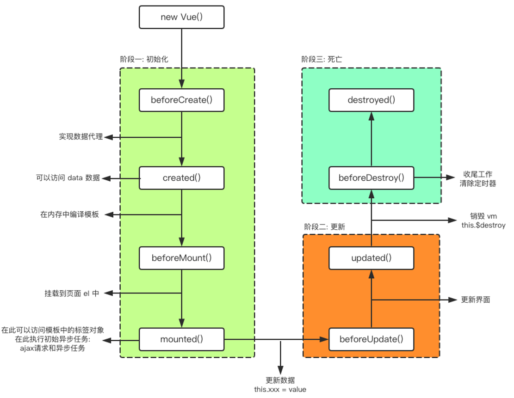

-----

# 二. Vue基础语法

## 定义vue的template

--04-vue的template.html

```html
<!DOCTYPE html>
<html lang="en">
<head>
    <meta charset="UTF-8">
    <title>Title</title>
</head>
<body>

<div id="app">
  {{message}}
</div>

<script src="../js/vue.js"></script>
<script>
  const app = new Vue({
    el: '#app',
    data: {
      message: '你好啊'
    }
  })
</script>

</body>
</html>
```


---

## 1. 插值语法

###      Mustache语法  

​	我们已经学习过了，可以通过Mustache语法(也就是双大括号)。

​	Mustache: 胡子胡须

--01-Mustache语法.html

```html
<!DOCTYPE html>
<html lang="en">
<head>
  <meta charset="UTF-8">
  <title>Title</title>
</head>
<body>

<div id="app">
  <h2>{{message}}</h2>
  <h2>{{message}}, 李银河!</h2>

  <!--mustache语法中,不仅仅可以直接写变量,也可以写简单的表达式-->
  <h2>{{firstName + lastName}}</h2>
  <h2>{{firstName + ' ' + lastName}}</h2>
  <h2>{{firstName}} {{lastName}}</h2>
  <h2>{{counter * 2}}</h2>
</div>

<script src="../js/vue.js"></script>
<script>
  const app = new Vue({
    el: '#app',
    data: {
      message: '你好啊',
      firstName: 'kobe',
      lastName: 'bryant',
      counter: 100
    },
  })
</script>

</body>
</html>
```

### v-once

​     在某些情况下，我们可能不希望界面随意的跟随改变  

```
v-once: 

​	该指令后面不需要跟任何表达式(比如之前的v-for后面是由跟表达式的)

​	该指令表示元素和组件(组件后面才会学习)只渲染一次，不会随着数据的改变而改变。
```

--02-v-once指令的使用.html

```html
<!DOCTYPE html>
<html lang="en">
<head>
  <meta charset="UTF-8">
  <title>Title</title>
</head>
<body>

<div id="app">
  <h2>{{message}}</h2>
  <h2 v-once>{{message}}</h2>
</div>

<script src="../js/vue.js"></script>
<script>
  const app = new Vue({
    el: '#app',
    data: {
      message: '你好啊'
    }
  })
</script>

</body>
</html>
```


---

### v-html

```
某些情况下，我们从服务器请求到的数据本身就是一个HTML代码
	如果我们直接通过{{}}来输出，会将HTML代码也一起输出。
	但是我们可能希望的是按照HTML格式进行解析，并且显示对应的内容。
如果我们希望解析出HTML展示
	可以使用v-html指令
		该指令后面往往会跟上一个string类型
		会将string的html解析出来并且进行渲染
```

--03-v-html指令的使用.html

```html
<!DOCTYPE html>
<html lang="en">
<head>
  <meta charset="UTF-8">
  <title>Title</title>
</head>
<body>

<div id="app">
  <h2>{{url}}</h2>
  <h2 v-html="url"></h2>
</div>

<script src="../js/vue.js"></script>
<script>
  const app = new Vue({
    el: '#app',
    data: {
      message: '你好啊',
      url: '<a href="http://www.baidu.com">百度一下</a>'
    }
  })
</script>

</body>
</html>
```

---

### v-text

```
v-text作用和Mustache比较相似：都是用于将数据显示在界面中
v-text通常情况下，接受一个string类型
```


### v-pre

```
v-pre用于跳过这个元素和它子元素的编译过程，用于显示原本的Mustache语法。
比如下面的代码：
	第一个h2元素中的内容会被编译解析出来对应的内容
	第二个h2元素中会直接显示{{message}}
```


###      **v-cloak**  

```
在某些情况下，我们浏览器可能会直接显然出未编译的Mustache标签。
cloak: 斗篷
```

--06-v-cloak指令的使用.html

```html
<!DOCTYPE html>
<html lang="en">
<head>
  <meta charset="UTF-8">
  <title>Title</title>
  <style>
    [v-cloak] {
      display: none;
    }
  </style>
</head>
<body>

<div id="app" v-cloak>
  <h2>{{message}}</h2>
</div>

<script src="../js/vue.js"></script>
<script>
  // 在vue解析之前, div中有一个属性v-cloak
  // 在vue解析之后, div中没有一个属性v-cloak
  setTimeout(function () {
    const app = new Vue({
      el: '#app',
      data: {
        message: '你好啊'
      }
    })
  }, 1000)
</script>

</body>
</html>
```

---

## 2. 绑定属性

### v-bind基本使用

```
前面我们学习的指令主要作用是将值插入到我们模板的内容当中。
	但是，除了内容需要动态来决定外，某些属性我们也希望动态来绑定。
		比如动态绑定a元素的href属性
		比如动态绑定img元素的src属性	
```

--01-v-bind的基本使用.html

```html
<!DOCTYPE html>
<html lang="en">
<head>
  <meta charset="UTF-8">
  <title>Title</title>
</head>
<body>

<div id="app">
  <!-- 错误的做法: 这里不可以使用mustache语法-->
  <!---->
  <!-- 正确的做法: 使用v-bind指令 -->
  
  <a v-bind:href="aHref">百度一下</a>
  <!--<h2>{{}}</h2>-->

  <!--语法糖的写法-->
  
  <a :href="aHref">百度一下</a>
</div>

<script src="../js/vue.js"></script>
<script>
  const app = new Vue({
    el: '#app',
    data: {
      message: '你好啊',
      imgURL: 'https://img11.360buyimg.com/mobilecms/s350x250_jfs/t1/20559/1/1424/73138/5c125595E3cbaa3c8/74fc2f84e53a9c23.jpg!q90!cc_350x250.webp',
      aHref: 'http://www.baidu.com'
    }
  })
</script>

</body>
</html>
```

---

###      v-bind绑定class

1. 对象语法


```html
<!DOCTYPE html>
<html lang="en">
<head>
  <meta charset="UTF-8">
  <title>Title</title>

  <style>
    .active {
      color: red;
    }
  </style>
</head>
<body>

<div id="app">
  <!--<h2 class="active">{{message}}</h2>-->
  <!--<h2 :class="active">{{message}}</h2>-->

  <!--<h2 v-bind:class="{key1: value1, key2: value2}">{{message}}</h2>-->
  <!--<h2 v-bind:class="{类名1: true, 类名2: boolean}">{{message}}</h2>-->
  <h2 class="title" v-bind:class="{active: isActive, line: isLine}">{{message}}</h2>
  <h2 class="title" v-bind:class="getClasses()">{{message}}</h2>
  <button v-on:click="btnClick">按钮</button>
</div>

<script src="../js/vue.js"></script>
<script>
  const app = new Vue({
    el: '#app',
    data: {
      message: '你好啊',
      isActive: true,
      isLine: true
    },
    methods: {
      btnClick: function () {
        this.isActive = !this.isActive
      },
      getClasses: function () {
        return {active: this.isActive, line: this.isLine}
      }
    }
  })
</script>

</body>
</html>
```

---

2. 数组语法  

   

--03-v-bind动态绑定class(数组语法).html

```html
<!DOCTYPE html>
<html lang="en">
<head>
  <meta charset="UTF-8">
  <title>Title</title>
</head>
<body>

<div id="app">
  <h2 class="title" :class="[active, line]">{{message}}</h2>
  <h2 class="title" :class="getClasses()">{{message}}</h2>
</div>

<script src="../js/vue.js"></script>
<script>
  const app = new Vue({
    el: '#app',
    data: {
      message: '你好啊',
      active: 'aaaaaa',
      line: 'bbbbbbb'
    },
    methods: {
      getClasses: function () {
        return [this.active, this.line]
      }
    }
  })
</script>

</body>
</html>
```

---

### v-bind绑定样式

```
我们可以利用v-bind:style来绑定一些CSS内联样式。
在写CSS属性名的时候，比如font-size
	我们可以使用驼峰式 (camelCase)  fontSize 
	或短横线分隔 (kebab-case，记得用单引号括起来) ‘font-size’
绑定class有两种方式：
	对象语法
	数组语法
```


1. 对象语法

   
   ---

--05-v-bind动态绑定style(对象语法).html

```html
<!DOCTYPE html>
<html lang="en">
<head>
  <meta charset="UTF-8">
  <title>Title</title>
  <style>
    .title {
      font-size: 50px;
      color: red;
    }
  </style>
</head>
<body>

<div id="app">
  <!--<h2 :style="{key(属性名): value(属性值)}">{{message}}</h2>-->

  <!--'50px'必须加上单引号, 否则是当做一个变量去解析-->
  <!--<h2 :style="{fontSize: '50px'}">{{message}}</h2>-->

  <!--finalSize当成一个变量使用-->
  <!--<h2 :style="{fontSize: finalSize}">{{message}}</h2>-->
  <h2 :style="{fontSize: finalSize + 'px', backgroundColor: finalColor}">{{message}}</h2>
  <h2 :style="getStyles()">{{message}}</h2>
</div>

<script src="../js/vue.js"></script>
<script>
  const app = new Vue({
    el: '#app',
    data: {
      message: '你好啊',
      finalSize: 100,
      finalColor: 'red',
    },
    methods: {
      getStyles: function () {
        return {fontSize: this.finalSize + 'px', backgroundColor: this.finalColor}
      }
    }
  })
</script>

</body>
</html>
```

---

2. 数组语法  

--06-v-bind动态绑定style(数组语法).html

```html
<!DOCTYPE html>
<html lang="en">
<head>
  <meta charset="UTF-8">
  <title>Title</title>
</head>
<body>

<div id="app">
  <h2 :style="[baseStyle, baseStyle1]">{{message}}</h2>
</div>

<script src="../js/vue.js"></script>
<script>
  const app = new Vue({
    el: '#app',
    data: {
      message: '你好啊',
      baseStyle: {backgroundColor: 'red'},
      baseStyle1: {fontSize: '100px'},
    }
  })
</script>

</body>
</html>
```

---

## 3. 计算属性


### 1.基本使用

--01-计算属性的基本使用.html

```html
<!DOCTYPE html>
<html lang="en">
<head>
  <meta charset="UTF-8">
  <title>Title</title>
</head>
<body>

<div id="app">
  <h2>{{firstName + ' ' + lastName}}</h2>
  <h2>{{firstName}} {{lastName}}</h2>

  <h2>{{getFullName()}}</h2>

  <h2>{{fullName}}</h2>
</div>

<script src="../js/vue.js"></script>
<script>
  const app = new Vue({
    el: '#app',
    data: {
      firstName: 'Lebron',
      lastName: 'James'
    },
    // computed: 计算属性()
    computed: {
      fullName: function () {
        return this.firstName + ' ' + this.lastName
      }
    },
    methods: {
      getFullName() {
        return this.firstName + ' ' + this.lastName
      }
    }
  })
</script>

</body>
</html>
```

---

### 2.复杂使用

--02-计算属性的复杂操作.html

```html
<!DOCTYPE html>
<html lang="en">
<head>
  <meta charset="UTF-8">
  <title>Title</title>
</head>
<body>

<div id="app">
  <h2>总价格: {{totalPrice}}</h2>
</div>

<script src="../js/vue.js"></script>
<script>
  const app = new Vue({
    el: '#app',
    data: {
      books: [
        {id: 110, name: 'Unix编程艺术', price: 119},
        {id: 111, name: '代码大全', price: 105},
        {id: 112, name: '深入理解计算机原理', price: 98},
        {id: 113, name: '现代操作系统', price: 87},
      ]
    },
    computed: {
      totalPrice: function () {
        let result = 0
        for (let i=0; i < this.books.length; i++) {
          result += this.books[i].price
        }
        return result

        // for (let i in this.books) {
        //   this.books[i]
        // }
        //
        // for (let book of this.books) {
        //
        // }
      }
    }
  })
</script>

</body>
</html>
```

---

### 3.计算属性的setter和getter

--03-计算属性的setter和getter.html

```html
<!DOCTYPE html>
<html lang="en">
<head>
  <meta charset="UTF-8">
  <title>Title</title>
</head>
<body>

<div id="app">
  <h2>{{fullName}}</h2>
</div>

<script src="../js/vue.js"></script>
<script>
  const app = new Vue({
    el: '#app',
    data: {
      firstName: 'Kobe',
      lastName: 'Bryant'
    },
    computed: {
      // fullName: function () {
      //   return this.firstName + ' ' + this.lastName
      // }
      // name: 'coderwhy'
      // 计算属性一般是没有set方法, 只读属性.
      fullName: {
        set: function(newValue) {
          // console.log('-----', newValue);
          const names = newValue.split(' ');
          this.firstName = names[0];
          this.lastName = names[1];
        },
        get: function () {
          return this.firstName + ' ' + this.lastName
        }
      },

      // 下面是简写形式
      // fullName: function () {
      //   return this.firstName + ' ' + this.lastName
      // }
    }
  })
</script>

</body>
</html>
```

---

### 4.计算属性的缓存


--04-计算属性和methods的对比.html

```html
<!DOCTYPE html>
<html lang="en">
<head>
  <meta charset="UTF-8">
  <title>Title</title>
</head>
<body>

<div id="app">
  <!--1.直接拼接: 语法过于繁琐-->
  <h2>{{firstName}} {{lastName}}</h2>

  <!--2.通过定义methods-->
  <!--<h2>{{getFullName()}}</h2>-->
  <!--<h2>{{getFullName()}}</h2>-->
  <!--<h2>{{getFullName()}}</h2>-->
  <!--<h2>{{getFullName()}}</h2>-->

  <!--3.通过computed-->
  <h2>{{fullName}}</h2>
  <h2>{{fullName}}</h2>
  <h2>{{fullName}}</h2>
  <h2>{{fullName}}</h2>
</div>

<script src="../js/vue.js"></script>
<script>
  // angular -> google
  // TypeScript(microsoft) -> ts(类型检测)
  // flow(facebook) ->
  const app = new Vue({
    el: '#app',
    data: {
      firstName: 'Kobe',
      lastName: 'Bryant'
    },
    methods: {
      getFullName: function () {
        console.log('getFullName');
        return this.firstName + ' ' + this.lastName
      }
    },
    computed: {
      fullName: function () {
        console.log('fullName');
        return this.firstName + ' ' + this.lastName
      }
    }
  })

</script>

</body>
</html>
```

---

## ES6补充

### let/var

--01-块级作用域(讲解).html

```html
<!DOCTYPE html>
<html lang="en">
<head>
  <meta charset="UTF-8">
  <title>Title</title>
</head>
<body>

<button>按钮1</button>
<button>按钮2</button>
<button>按钮3</button>
<button>按钮4</button>
<button>按钮5</button>

<script>
  // ES5中的var是没有块级作用域的(if/for)
  // ES6中的let是由块级作用的(if/for)

  // ES5之前因为if和for都没有块级作用域的概念, 所以在很多时候, 我们都必须借助于function的作用域来解决应用外面变量的问题.
  // ES6中,加入了let, let它是有if和for的块级作用域.
  // 1.变量作用域: 变量在什么范围内是可用.
  // {
  //   var name = 'why';
  //   console.log(name);
  // }
  // console.log(name);

  // 2.没有块级作用域引起的问题: if的块级
  // var func;
  // if (true) {
  //   var name = 'why';
  //   func = function () {
  //     console.log(name);
  //   }
  //   // func()
  // }
  // name = 'kobe'
  // func()
  // // console.log(name);

  var name = 'why'
  function abc(bbb) { // bbb = 'why'
    console.log(bbb);
  }
  abc(name)
  name = 'kobe'

  // 3.没有块级作用域引起的问题: for的块级
  // 为什么闭包可以解决问题: 函数是一个作用域.
  // var btns = document.getElementsByTagName('button');
  // for (var i=0; i<btns.length; i++) {
  //   (function (num) { // 0
  //     btns[i].addEventListener('click', function () {
  //       console.log('第' + num + '个按钮被点击');
  //     })
  //   })(i)
  // }

  const btns = document.getElementsByTagName('button')
  for (let i = 0; i < btns.length; i++) {

    // 为 <button> 元素添加点击事件。
    btns[i].addEventListener('click', function () {
      console.log('第' + i + '个按钮被点击');
    })
  }
  // ES5
  // var i = 5
  // {
  //   btns[i].addEventListener('click', function () {
  //   console.log('第' + i + '个按钮被点击');
  // })
  // }
  //
  // {
  //   btns[i].addEventListener('click', function () {
  //     console.log('第' + i + '个按钮被点击');
  //   })
  // }
  //
  //
  // {
  //   btns[i].addEventListener('click', function () {
  //     console.log('第' + i + '个按钮被点击');
  //   })
  // }
  //
  //
  // {
  //   btns[i].addEventListener('click', function () {
  //     console.log('第' + i + '个按钮被点击');
  //   })
  // }
  //
  // {
  //   btns[i].addEventListener('click', function () {
  //     console.log('第' + i + '个按钮被点击');
  //   })
  // }
  //
  // // ES6
  // { i = 0
  //   btns[i].addEventListener('click', function () {
  //     console.log('第' + i + '个按钮被点击');
  //   })
  // }
  //
  // { i = 1
  //   btns[i].addEventListener('click', function () {
  //     console.log('第' + i + '个按钮被点击');
  //   })
  // }
  // { i = 2
  //   btns[i].addEventListener('click', function () {
  //     console.log('第' + i + '个按钮被点击');
  //   })
  // }
  // { i = 3
  //   btns[i].addEventListener('click', function () {
  //     console.log('第' + i + '个按钮被点击');
  //   })
  // }
  // { i = 4
  //   btns[i].addEventListener('click', function () {
  //     console.log('第' + i + '个按钮被点击');
  //   })
  // }

</script>

</body>
</html>
```

--02-块级作用域(es5没闭包-有闭包-let对比).html

```html
<!DOCTYPE html>
<html lang="en">
<head>
  <meta charset="UTF-8">
  <title>Title</title>
</head>
<body>

<button>按钮1</button>
<button>按钮2</button>
<button>按钮3</button>

<script>
  // 1.没有块级作用域引起的问题: for的块级
  // 为什么闭包可以解决问题: 函数是一个作用域.
  var btns = document.getElementsByTagName('button');
  for (var i=0; i<btns.length; i++) {
    btns[i].addEventListener('click', function () {
      console.log('第' + i + '个按钮被点击');
    })
  }

  // 1.情况一: ES5中没有使用闭包(错误的方式)
  i = 2
  {
    // i = 0
    btns[i].addEventListener('click', function () {
      console.log('第' + i + '个按钮被点击');
    })
  }

  {
    i = 1
    btns[i].addEventListener('click', function () {
      console.log('第' + i + '个按钮被点击');
    })
  }

  {
    // i = 2
    btns[i].addEventListener('click', function () {
      console.log('第' + i + '个按钮被点击');
    })
  }

  // 2.情况二: ES5中使用闭包
  var btns = document.getElementsByTagName('button');
  for (var i=0; i<btns.length; i++) {
    // 定义匿名函数并执行
    (function (index) { // 0
      btns[index].addEventListener('click', function () {
        console.log('第' + index + '个按钮被点击');
      })
    }) (i)
  }

  i = 100000000
  function (i) { // i = 0
    btns[i].addEventListener('click', function () {
      console.log('第' + i + '个按钮被点击');
    })
  }(0)

  function (i) { // i = 1
    btns[i].addEventListener('click', function () {
      console.log('第' + i + '个按钮被点击');
    })
  }(1)

  function (i) { // i = 2
    btns[i].addEventListener('click', function () {
      console.log('第' + i + '个按钮被点击');
    })
  }(2)

  // ES6中的let
  const btns = document.getElementsByTagName('button')
  for (let i = 0; i < btns.length; i++) {
    btns[i].addEventListener('click', function () {
      console.log('第' + i + '个按钮被点击');
    })
  }
  i = 10000000
  { i = 0
    btns[i].addEventListener('click', function () {
      console.log('第' + i + '个按钮被点击');
    })
  }

  { i = 1
    btns[i].addEventListener('click', function () {
      console.log('第' + i + '个按钮被点击');
    })
  }

  { i = 2
    btns[i].addEventListener('click', function () {
      console.log('第' + i + '个按钮被点击');
    })
  }

</script>

</body>
</html>
```

### const的使用


--03-const的使用.html

```html
<!DOCTYPE html>
<html lang="en">
<head>
  <meta charset="UTF-8">
  <title>Title</title>
</head>
<body>

<script>
  // 1.注意一: 一旦给const修饰的标识符被赋值之后, 不能修改
  // const name = 'why';
  // name = 'abc';

  // 2.注意二: 在使用const定义标识符,必须进行赋值
  // const name;

  // 3.注意三: 常量的含义是指向的对象不能修改, 但是可以改变对象内部的属性.
  const obj = {
    name: 'why',
    age: 18,
    height: 1.88
  }
  // obj = {}
  console.log(obj);

  obj.name = 'kobe';
  obj.age = 40;
  obj.height = 1.87;

  console.log(obj);
</script>

</body>
</html>
```

---

### 对象增强写法


--04-对象字面量的增强写法.html04-对象字面量的增强写法.html

```html
<!DOCTYPE html>
<html lang="en">
<head>
  <meta charset="UTF-8">
  <title>Title</title>
</head>
<body>

<script>
  // const obj = new Object()

  // const obj = {
  //   name: 'why',
  //   age: 18,
  //   run: function () {
  //     console.log('在奔跑');
  //   },
  //   eat: function () {
  //     console.log('在次东西');
  //   }
  // }

  // 1.属性的增强写法
  const name = 'why';
  const age = 18;
  const height = 1.88

  // ES5的写法
  // const obj = {
  //   name: name,
  //   age: age,
  //   height: height
  // }

  // const obj = {
  //   name,
  //   age,
  //   height,
  // }
  //
  // console.log(obj);


  // 2.函数的增强写法
  // ES5的写法
  // const obj = {
  //   run: function () {
  //
  //   },
  //   eat: function () {
  //
  //   }
  // }
  const obj = {
    run() {

    },
    eat() {

    }
  }
</script>

</body>
</html>
```

---

## 4.事件监听

### v-on基础


--01-v-on的基本使用.html

```html
<!DOCTYPE html>
<html lang="en">
<head>
  <meta charset="UTF-8">
  <title>Title</title>
</head>
<body>

<div id="app">
  <h2>{{counter}}</h2>
  <!--<h2 v-bind:title></h2>-->
  <!--<h2 :title></h2>-->
  <!--<button v-on:click="counter++">+</button>-->
  <!--<button v-on:click="counter&#45;&#45;">-</button>-->
  <!--<button v-on:click="increment">+</button>-->
  <!--<button v-on:click="decrement">-</button>-->
  <button @click="increment">+</button>
  <button @click="decrement">-</button>
</div>

<script src="../js/vue.js"></script>
<script>
  const app = new Vue({
    el: '#app',
    data: {
      counter: 0
    },
    methods: {
      increment() {
        this.counter++
      },
      decrement() {
        this.counter--
      }
    }
  })
</script>

</body>
</html>
```

---

### v-on参数


--02-v-on的参数问题.html

```html
<!DOCTYPE html>
<html lang="en">
<head>
  <meta charset="UTF-8">
  <title>Title</title>
</head>
<body>

<div id="app">
  <!--1.事件调用的方法没有参数-->
  <button @click="btn1Click()">按钮1</button>
  <button @click="btn1Click">按钮1</button>

  <!--2.在事件定义时, 写方法时省略了小括号, 但是方法本身是需要一个参数的, 这个时候, Vue会默认将浏览器生产的event事件对象作为参数传入到方法-->
  <!--<button @click="btn2Click(123)">按钮2</button>-->
  <!--<button @click="btn2Click()">按钮2</button>-->
  <button @click="btn2Click">按钮2</button>

  <!--3.方法定义时, 我们需要event对象, 同时又需要其他参数-->
  <!-- 在调用方式, 如何手动的获取到浏览器参数的event对象: $event-->
  <button @click="btn3Click(abc, $event)">按钮3</button>
</div>

<script src="../js/vue.js"></script>
<script>
  const app = new Vue({
    el: '#app',
    data: {
      message: '你好啊',
      abc: 123
    },
    methods: {
      btn1Click() {
        console.log("btn1Click");
      },
      btn2Click(event) {
        console.log('--------', event);
      },
      btn3Click(abc, event) {
        console.log('++++++++', abc, event);
      }
    }
  })

  // 如果函数需要参数,但是没有传入, 那么函数的形参为undefined
  // function abc(name) {
  //   console.log(name);
  // }
  //
  // abc()
</script>

</body>
</html>
```

---

### v-on修饰符


--03-v-on的修饰符.html

```html
<!DOCTYPE html>
<html lang="en">
<head>
  <meta charset="UTF-8">
  <title>Title</title>
</head>
<body>

<div id="app">
  <!--1. .stop修饰符的使用-->
  <!-- 解决js事件冒泡问题-->
  <div @click="divClick">
    aaaaaaa
    <button @click.stop="btnClick">按钮</button>
  </div>

  <!--2. .prevent修饰符的使用-->
  <!--  阻止默认事件-->
  <!--  这里阻止的是默认提交-->
  <br>
  <form action="baidu">
    <input type="submit" value="提交" @click.prevent="submitClick">
  </form>

  <!--3. .监听某个键盘的键帽-->
  <!--  监听回车-->
  <input type="text" @keyup.enter="keyUp">

  <!--4. .once修饰符的使用-->
  <!--  这里只允许按钮点击一次-->
  <button @click.once="btn2Click">按钮2</button>
</div>

<script src="../js/vue.js"></script>
<script>
  const app = new Vue({
    el: '#app',
    data: {
      message: '你好啊'
    },
    methods: {
      btnClick() {
        console.log("btnClick");
      },
      divClick() {
        console.log("divClick");
      },
      submitClick() {
        console.log('submitClick');
      },
      keyUp() {
        console.log('keyUp');
      },
      btn2Click() {
        console.log('btn2Click');
      }
    }
  })
</script>

</body>
</html>
```

---

## 5.条件判断

### v-if、v-else-if、v-else


--01-v-if的使用.html

```html
<!DOCTYPE html>
<html lang="en">
<head>
  <meta charset="UTF-8">
  <title>Title</title>
</head>
<body>

<div id="app">
  <h2 v-if="isShow">
    <div>abc</div>
    <div>abc</div>
    <div>abc</div>
    <div>abc</div>
    <div>abc</div>
    {{message}}
  </h2>
</div>

<script src="../js/vue.js"></script>
<script>
  const app = new Vue({
    el: '#app',
    data: {
      message: '你好啊',
      isShow: true
    }
  })
</script>

</body>
</html>
```

--02-v-if和v-else的使用.html

```html
<!DOCTYPE html>
<html lang="en">
<head>
  <meta charset="UTF-8">
  <title>Title</title>
</head>
<body>

<div id="app">
  <h2 v-if="isShow">
    <div>abc</div>
    <div>abc</div>
    <div>abc</div>
    <div>abc</div>
    <div>abc</div>
    {{message}}
  </h2>
  <h1 v-else>isShow为false时, 显示我</h1>
</div>

<script src="../js/vue.js"></script>
<script>
  const app = new Vue({
    el: '#app',
    data: {
      message: '你好啊',
      isShow: true
    }
  })
</script>

</body>
</html>
```

--03-v-if和v-else-if和v-else的使用.html

```html
<!DOCTYPE html>
<html lang="en">
<head>
  <meta charset="UTF-8">
  <title>Title</title>
</head>
<body>

<div id="app">
  <!--  双引号是表达式-->
  <!--  单引号是字符串-->
  <!--  不叫单引号一般都是变量-->
  <h2 v-if="score>=90">优秀</h2>
  <h2 v-else-if="score>=80">良好</h2>
  <h2 v-else-if="score>=60">及格</h2>
  <h2 v-else>不及格</h2>

  <h1>{{result}}</h1>
</div>

<script src="../js/vue.js"></script>
<script>
  const app = new Vue({
    el: '#app',
    data: {
      score: 99
    },
    computed: {
      result() {
        let showMessage = '';
        if (this.score >= 90) {
          showMessage = '优秀'
        } else if (this.score >= 80) {
          showMessage = '良好'
        }
        // ...
        return showMessage
      }
    }
  })
</script>

</body>
</html>
```

---

### 条件渲染案例


--04-用户登录切换的案例.html

```html
<!DOCTYPE html>
<html lang="en">
<head>
  <meta charset="UTF-8">
  <title>Title</title>
</head>
<body>

<div id="app">
  <span v-if="isUser">
    <label for="username">用户账号</label>
    <input type="text" id="username" placeholder="用户账号">
  </span>
  <span v-else>
    <label for="email">用户邮箱</label>
    <input type="text" id="email" placeholder="用户邮箱">
  </span>
  <button @click="isUser = !isUser">切换类型</button>
</div>

<script src="../js/vue.js"></script>
<script>
  const app = new Vue({
    el: '#app',
    data: {
      isUser: true
    }
  })
</script>

</body>
</html>
```

### 案例小问题


--05-用户登录切换的案例(小问题).html05-用户登录切换的案例(小问题).html

```html
<!DOCTYPE html>
<html lang="en">
<head>
  <meta charset="UTF-8">
  <title>Title</title>
</head>
<body>

<div id="app">
  <span v-if="isUser">
    <label for="username">用户账号</label>
    <!--key在这里是标识符，key相同是可以复用的，不同不可以复用-->
    <input type="text" id="username" placeholder="用户账号" key="username">
  </span>
  <span v-else>
    <label for="email">用户邮箱</label>
    <input type="text" id="email" placeholder="用户邮箱" key="email">
  </span>
  <button @click="isUser = !isUser">切换类型</button>
</div>

<script src="../js/vue.js"></script>
<script>
  const app = new Vue({
    el: '#app',
    data: {
      isUser: true
    }
  })
</script>

</body>
</html>
```

---

### v-show


--06-v-show的使用.html

```html
<!DOCTYPE html>
<html lang="en">
<head>
  <meta charset="UTF-8">
  <title>Title</title>
</head>
<body>

<div id="app">
  <!--v-if: 当条件为false时, 包含v-if指令的元素, 根本就不会存在dom中-->
  <h2 v-if="isShow" id="aaa">{{message}}</h2>

  <!--v-show: 当条件为false时, v-show只是给我们的元素添加一个行内样式: display: none-->
  <h2 v-show="isShow" id="bbb">{{message}}</h2>
</div>

<script src="../js/vue.js"></script>
<script>
  const app = new Vue({
    el: '#app',
    data: {
      message: '你好啊',
      isShow: true
    }
  })
</script>

</body>
</html>
```

---

## 6.循环遍历

### v-for遍历数组


--01-v-for遍历数组.html

```html
<!DOCTYPE html>
<html lang="en">
<head>
  <meta charset="UTF-8">
  <title>Title</title>
</head>
<body>

<div id="app">
  <!--1.在遍历的过程中,没有使用索引值(下标值)-->
  <ul>
    <li v-for="item in names">{{item}}</li>
  </ul>

  <!--2.在遍历的过程中, 获取索引值-->
  <ul>
    <li v-for="(item, index) in names">
      {{index+1}}.{{item}}
    </li>
  </ul>
</div>

<script src="../js/vue.js"></script>
<script>
  const app = new Vue({
    el: '#app',
    data: {
      names: ['why', 'kobe', 'james', 'curry']
    }
  })
</script>

</body>
</html>
```

### v-for遍历对象

--02-v-for遍历对象.html

```html
<!DOCTYPE html>
<html lang="en">
<head>
  <meta charset="UTF-8">
  <title>Title</title>
</head>
<body>

<div id="app">
  <!--1.在遍历对象的过程中, 如果只是获取一个值, 那么获取到的是value-->
  <ul>
    <li v-for="item in info">{{item}}</li>
  </ul>


  <!--2.获取key和value 格式: (value, key) -->
  <ul>
    <li v-for="(value, key) in info">{{value}}-{{key}}</li>
  </ul>


  <!--3.获取key和value和index 格式: (value, key, index) -->
  <ul>
    <li v-for="(value, key, index) in info">{{value}}-{{key}}-{{index}}</li>
  </ul>
</div>

<script src="../js/vue.js"></script>
<script>
  const app = new Vue({
    el: '#app',
    data: {
      info: {
        name: 'why',
        age: 18,
        height: 1.88
      }
    }
  })
</script>

</body>
</html>
```

### 组件的key属性


--03-v-for使用过程添加key.html

```HTML
<!DOCTYPE html>
<html lang="en">
<head>
  <meta charset="UTF-8">
  <title>Title</title>
</head>
<body>

<div id="app">
  <ul>
    <!--key要与item一一对应-->
    <li v-for="item in letters" :key="item">{{item}}</li>
  </ul>
</div>

<script src="../js/vue.js"></script>
<script>
  const app = new Vue({
    el: '#app',
    data: {
      letters: ['A', 'B', 'C', 'D', 'E']
    }
  })
</script>

</body>
</html>
```


---

### 检测数组更新


--04-哪些数组的方法是响应式的.html

```html
<!DOCTYPE html>
<html lang="en">
<head>
  <meta charset="UTF-8">
  <title>Title</title>
</head>
<body>

<div id="app">
  <ul>
    <li v-for="item in letters">{{item}}</li>
  </ul>
  <button @click="btnClick">按钮</button>
</div>

<script src="../js/vue.js"></script>
<script>
  const app = new Vue({
    el: '#app',
    data: {
      letters: ['a', 'b', 'c', 'd']
    },
    methods: {
      btnClick() {
        // 1.push方法
        // this.letters.push('aaa')
        // this.letters.push('aaaa', 'bbbb', 'cccc')

        // 2.pop(): 删除数组中的最后一个元素
        // this.letters.pop();

        // 3.shift(): 删除数组中的第一个元素
        // this.letters.shift();

        // 4.unshift(): 在数组最前面添加元素
        // this.letters.unshift()
        // this.letters.unshift('aaa', 'bbb', 'ccc')

        // 5.splice作用: 删除元素/插入元素/替换元素
        // 删除元素: 第二个参数传入你要删除几个元素(如果没有传,就删除后面所有的元素)
        // 替换元素: 第二个参数, 表示我们要替换几个元素, 后面是用于替换前面的元素
        // 插入元素: 第二个参数, 传入0, 并且后面跟上要插入的元素
        // splice(start)
        // splice(start):
        this.letters.splice(1, 3, 'm', 'n', 'l', 'x')
        // this.letters.splice(1, 0, 'x', 'y', 'z')

        // 5.sort()
        // this.letters.sort()

        // 6.reverse()
        // this.letters.reverse()

        // 注意: 通过索引值修改数组中的元素
        // 这不是响应的
        // this.letters[0] = 'bbbbbb';
        // this.letters.splice(0, 1, 'bbbbbb')
        // set(要修改的对象, 索引值, 修改后的值)
        // Vue.set(this.letters, 0, 'bbbbbb')
      }
    }
  })


  // function sum(num1, num2) {
  //   return num1 + num2
  // }
  //
  // function sum(num1, num2, num3) {
  //   return num1 + num2 + num3
  // }
  // 可变参数
  // function sum(...num) {
  //   console.log(num);
  // }
  //
  // sum(20, 30, 40, 50, 601, 111, 122, 33)

</script>

</body>
</html>
```

----

### 作业的回顾和完成

--05-作业的回顾和完成.html

```html
<!DOCTYPE html>
<html lang="en">
<head>
  <meta charset="UTF-8">
  <title>Title</title>
  <style>
    .active {
      color: red;
    }
  </style>
</head>
<body>

<div id="app">
  <ul>
    <li v-for="(item, index) in movies"
        :class="{active: currentIndex === index}"
        @click="liClick(index)">
      {{index}}.{{item}}
    </li>

    <!--<li :class="{active: 0===currentIndex}"></li>-->
    <!--<li :class="{active: 1===currentIndex}"></li>-->
    <!--<li :class="{active: 2===currentIndex}"></li>-->
    <!--<li :class="{active: 3===currentIndex}"></li>-->
  </ul>
</div>

<script src="../js/vue.js"></script>
<script>
  const app = new Vue({
    el: '#app',
    data: {
      movies: ['海王', '海贼王', '加勒比海盗', '海尔兄弟'],
      currentIndex: 0
    },
    methods: {
      liClick(index) {
        this.currentIndex = index
      }
    }
  })
</script>

</body>
</html>
```

---

## 7.阶段案例

​     **图书购物车**  


--index.html

```html
<!DOCTYPE html>
<html lang="en">
<head>
  <meta charset="UTF-8">
  <title>Title</title>
  <link rel="stylesheet" href="style.css">
</head>
<body>

<div id="app">
  <div v-if="books.length">
    <table>
      <thead>
      <tr>
        <th></th>
        <th>书籍名称</th>
        <th>出版日期</th>
        <th>价格</th>
        <th>购买数量</th>
        <th>操作</th>
      </tr>
      </thead>
      <tbody>
      <tr v-for="(item, index) in books">
        <td>{{item.id}}</td>
        <td>{{item.name}}</td>
        <td>{{item.date}}</td>
        <!--这里使用了过滤器-->
        <td>{{item.price | showPrice}}</td>
        <td>
          <button @click="decrement(index)" v-bind:disabled="item.count <= 1">-</button>
          {{item.count}}
          <button @click="increment(index)">+</button>
        </td>
        <td><button @click="removeHandle(index)">移除</button></td>
      </tr>
      </tbody>
    </table>
    <h2>总价格: {{totalPrice | showPrice}}</h2>
  </div>
  <h2 v-else>购物车为空</h2>
</div>

<!--下面引入的顺序不能乱-->
<script src="../js/vue.js"></script>
<script src="main.js"></script>
<script>
</script>
</body>
</html>
```

--main.js

```js
const app = new Vue({
  el: '#app',
  data: {
    books: [
      {
        id: 1,
        name: '《算法导论》',
        date: '2006-9',
        price: 85.00,
        count: 1
      },
      {
        id: 2,
        name: '《UNIX编程艺术》',
        date: '2006-2',
        price: 59.00,
        count: 1
      },
      {
        id: 3,
        name: '《编程珠玑》',
        date: '2008-10',
        price: 39.00,
        count: 1
      },
      {
        id: 4,
        name: '《代码大全》',
        date: '2006-3',
        price: 128.00,
        count: 1
      },
    ]
  },
  methods: {
    // getFinalPrice(price) {
    //   return '¥' + price.toFixed(2)
    // }
    increment(index) {
      this.books[index].count++
    },
    decrement(index) {
      this.books[index].count--
    },
    removeHandle(index) {
      this.books.splice(index, 1)
    }
  },
  computed: {
    totalPrice() {
      let totalPrice = 0
      for (let i = 0; i < this.books.length; i++) {
        totalPrice += this.books[i].price * this.books[i].count
      }
      return totalPrice

      // for (let i in/of this.books)
      // reduce
    }
  },
  filters: {
    showPrice(price) {
      return '¥' + price.toFixed(2)
    }
  }
})
```

--style.css

```css
table {
  border: 1px solid #e9e9e9;
  border-collapse: collapse;
  border-spacing: 0;
}

th, td {
  padding: 8px 16px;
  border: 1px solid #e9e9e9;
  text-align: left;
}

th {
  background-color: #f7f7f7;
  color: #5c6b77;
  font-weight: 600;
}
```

---

## 8.js高阶函数

--高阶函数.js

```js
// 编程范式: 命令式编程/声明式编程
// 编程范式: 面向对象编程(第一公民:对象)/函数式编程(第一公民:函数)
// filter/map/reduce
// filter中的回调函数有一个要求: 必须返回一个boolean值
// true: 当返回true时, 函数内部会自动将这次回调的n加入到新的数组中
// false: 当返回false时, 函数内部会过滤掉这次的n
const nums = [10, 20, 111, 222, 444, 40, 50]

// let total = nums.filter(n => n < 100).map(n => n * 2).reduce((pre, n) => pre + n);
// console.log(total);

let total = nums.filter(function (n) {
  return n < 100
}).map(function (n) {
  return n * 2
}).reduce(function (prevValue, n) {
  return prevValue + n
}, 0)
console.log(total);

// 1.filter函数的使用
// // 10, 20, 40, 50
// let newNums = nums.filter(function (n) {
//   return n < 100
// })
// // console.log(newNums);
//
// // 2.map函数的使用
// // 20, 40, 80, 100
// let new2Nums = newNums.map(function (n) { // 20
//   return n * 2
// })
// console.log(new2Nums);
//
// // 3.reduce函数的使用
// // reduce作用对数组中所有的内容进行汇总
// let total = new2Nums.reduce(function (preValue, n) {
//   return preValue + n
// }, 0)
// console.log(total);
// preValue是上一个计算的返回值
// 第一次: preValue 0 n 20
// 第二次: preValue 20 n 40
// 第二次: preValue 60 n 80
// 第二次: preValue 140 n 100
// 240

// // 1.需求: 取出所有小于100的数字
// let newNums = []
// for (let n of nums) {
//   if (n < 100) {
//     newNums.push(n)
//   }
// }
//
// // 2.需求:将所有小于100的数字进行转化: 全部*2
// let new2Nums = []
// for (let n of newNums) {
//   new2Nums.push(n * 2)
// }
//
// console.log(new2Nums);
//
//
// // 3.需求:将所有new2Nums数字相加,得到最终的记过
// let total = 0
// for (let n of new2Nums) {
//   total += n
// }
//
// console.log(total);
```

---

## 9.v-model

### 表单绑定v-model


--01-v-model的基本使用.html

```html
<!DOCTYPE html>
<html lang="en">
<head>
  <meta charset="UTF-8">
  <title>Title</title>
</head>
<body>

<div id="app">
  <input type="text" v-model="message">
  {{message}}
</div>

<script src="../js/vue.js"></script>
<script>
  const app = new Vue({
    el: '#app',
    data: {
      message: '你好啊'
    }
  })
</script>

</body>
</html>
```

---

### v-model原理


--02-v-model的原理.html

```html
<!DOCTYPE html>
<html lang="en">
<head>
  <meta charset="UTF-8">
  <title>Title</title>
</head>
<body>

<div id="app">
  <!--<input type="text" v-model="message">-->

  <!--input用于监听用户是否有输入操作-->
  <!--<input type="text" :value="message" @input="valueChange">-->
  <input type="text" :value="message" @input="message = $event.target.value">
  <h2>{{message}}</h2>
</div>

<script src="../js/vue.js"></script>
<script>
  const app = new Vue({
    el: '#app',
    data: {
      message: '你好啊'
    },
    methods: {
      valueChange(event) {
        this.message = event.target.value;
      }
    }
  })
</script>

</body>
</html>
```

---

### v-model：radio


--03-v-model结合radio类型.html

```html
<!DOCTYPE html>
<html lang="en">
<head>
  <meta charset="UTF-8">
  <title>Title</title>
</head>
<body>

<div id="app">
  <label for="male">
  <!--添加name属性两者才会互斥，达到不能同时选择两个性别的效果-->
  <!--<input type="radio" id="male" name="sex" value="男" v-model="sex">男-->
    <input type="radio" id="male" value="男" v-model="sex">男
  </label>
  <label for="female">
    <input type="radio" id="female" value="女" v-model="sex">女
  </label>
  <h2>您选择的性别是: {{sex}}</h2>
</div>

<script src="../js/vue.js"></script>
<script>
  const app = new Vue({
    el: '#app',
    data: {
      message: '你好啊',
      sex: '女'
    }
  })
</script>

</body>
</html>
```

---

### v-model：checkbox


--04-v-model结合checkbox类型.html

```html
<!DOCTYPE html>
<html lang="en">
<head>
  <meta charset="UTF-8">
  <title>Title</title>
</head>
<body>

<div id="app">
  <!--1.checkbox单选框-->
  <!--<label for="agree">-->
    <!--<input type="checkbox" id="agree" v-model="isAgree">同意协议-->
  <!--</label>-->
  <!--<h2>您选择的是: {{isAgree}}</h2>-->
  <!--<button :disabled="!isAgree">下一步</button>-->

  <!--2.checkbox多选框-->
  <input type="checkbox" value="篮球" v-model="hobbies">篮球
  <input type="checkbox" value="足球" v-model="hobbies">足球
  <input type="checkbox" value="乒乓球" v-model="hobbies">乒乓球
  <input type="checkbox" value="羽毛球" v-model="hobbies">羽毛球
  <h2>您的爱好是: {{hobbies}}</h2>

  <label v-for="item in originHobbies" :for="item">
    <input type="checkbox" :value="item" :id="item" v-model="hobbies">{{item}}
  </label>
</div>

<script src="../js/vue.js"></script>
<script>
  const app = new Vue({
    el: '#app',
    data: {
      message: '你好啊',
      isAgree: false, // 单选框
      hobbies: [], // 多选框,
      originHobbies: ['篮球', '足球', '乒乓球', '羽毛球', '台球', '高尔夫球']
    }
  })
</script>

</body>
</html>
```

---

### v-model：select


--05-v-model结合select类型.html

```html
<!DOCTYPE html>
<html lang="en">
<head>
  <meta charset="UTF-8">
  <title>Title</title>
</head>
<body>

<div id="app">
  <!--1.选择一个-->
  <select name="abc" v-model="fruit">
    <option value="苹果">苹果</option>
    <option value="香蕉">香蕉</option>
    <option value="榴莲">榴莲</option>
    <option value="葡萄">葡萄</option>
  </select>
  <h2>您选择的水果是: {{fruit}}</h2>

  <!--2.选择多个-->
  <select name="abc" v-model="fruits" multiple>
    <option value="苹果">苹果</option>
    <option value="香蕉">香蕉</option>
    <option value="榴莲">榴莲</option>
    <option value="葡萄">葡萄</option>
  </select>
  <h2>您选择的水果是: {{fruits}}</h2>
</div>

<script src="../js/vue.js"></script>
<script>
  const app = new Vue({
    el: '#app',
    data: {
      message: '你好啊',
      fruit: '香蕉',
      fruits: []
    }
  })
</script>

</body>
</html>
```

---

### 修饰符


--06-v-model修饰符的使用.html

```html
<!DOCTYPE html>
<html lang="en">
<head>
  <meta charset="UTF-8">
  <title>Title</title>
</head>
<body>

<div id="app">
  <!--1.修饰符: lazy-->
  <input type="text" v-model.lazy="message">
  <h2>{{message}}</h2>


  <!--2.修饰符: number-->
  <input type="number" v-model.number="age">
  <!--typeof获取类型-->
  <h2>{{age}}-{{typeof age}}</h2>

  <!--3.修饰符: trim-->
  <input type="text" v-model.trim="name">
  <h2>您输入的名字:{{name}}</h2>
</div>

<script src="../js/vue.js"></script>
<script>
  const app = new Vue({
    el: '#app',
    data: {
      message: '你好啊',
      age: 0,
      name: ''
    }
  })

  var age = 0
  age = '1111'
  age = '222'
</script>

</body>
</html>
```

---

# 三. 组件化开发

##  1.认识组件化

### 什么是组件化？


### Vue组件化思想


----

## 2. 组件化基础

###  注册组件

#### 注册的基本步骤

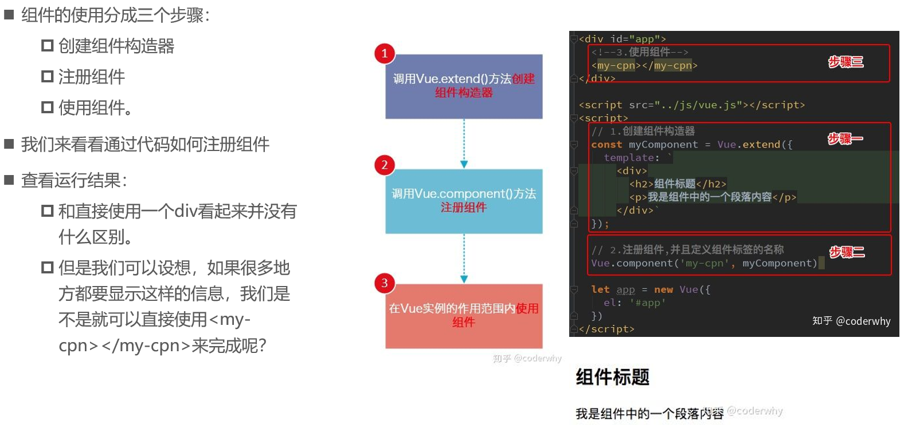


--01-组件化的基本使用.html

```html
<!DOCTYPE html>
<html lang="en">
<head>
  <meta charset="UTF-8">
  <title>Title</title>
</head>
<body>

<div id="app">
  <!--3.使用组件-->
  <my-cpn></my-cpn>
  <my-cpn></my-cpn>
  <my-cpn></my-cpn>
  <my-cpn></my-cpn>

  <div>
    <div>
      <my-cpn></my-cpn>
    </div>
  </div>
</div>

<my-cpn></my-cpn>

<script src="../js/vue.js"></script>
<script>
  // 1.创建组件构造器对象
  const cpnC = Vue.extend({
    template: `
      <div>
        <h2>我是标题</h2>
        <p>我是内容, 哈哈哈哈</p>
        <p>我是内容, 呵呵呵呵</p>
      </div>`
  })

  // 2.注册组件
  Vue.component('my-cpn', cpnC)

  const app = new Vue({
    el: '#app',
    data: {
      message: '你好啊'
    }
  })
</script>

</body>
</html>
```

---

#### 全局和局部组件


--02-全局组件和局部组件.html

```html
<!DOCTYPE html>
<html lang="en">
<head>
  <meta charset="UTF-8">
  <title>Title</title>
</head>
<body>

<div id="app">
  <cpn></cpn>
  <cpn></cpn>
  <cpn></cpn>
</div>

<div id="app2">
  <cpn></cpn>
</div>

<script src="../js/vue.js"></script>
<script>
  // 1.创建组件构造器
  const cpnC = Vue.extend({
    template: `
      <div>
        <h2>我是标题</h2>
        <p>我是内容,哈哈哈哈啊</p>
      </div>
    `
  })

  // 2.注册组件(全局组件, 意味着可以在多个Vue的实例下面使用)
  // Vue.component('cpn', cpnC)

  // 疑问: 怎么注册的组件才是局部组件了?

  const app = new Vue({
    el: '#app',
    data: {
      message: '你好啊'
    },
    // 局部组件
    components: {
      // cpn使用组件时的标签名
      cpn: cpnC
    }
  })

  const app2 = new Vue({
    el: '#app2'
  })
</script>

</body>
</html>
```

---

#### 父组件和子组件


--03-父组件和子组件.html

```html
<!DOCTYPE html>
<html lang="en">
<head>
  <meta charset="UTF-8">
  <title>Title</title>
</head>
<body>

<div id="app">
  <cpn2></cpn2>
  <!--<cpn1></cpn1>-->
</div>

<script src="../js/vue.js"></script>
<script>
  // 1.创建第一个组件构造器(子组件)
  const cpnC1 = Vue.extend({
    template: `
      <div>
        <h2>我是标题1</h2>
        <p>我是内容, 哈哈哈哈</p>
      </div>
    `
  })


  // 2.创建第二个组件构造器(父组件)
  const cpnC2 = Vue.extend({
    template: `
      <div>
        <h2>我是标题2</h2>
        <p>我是内容, 呵呵呵呵</p>
        <cpn1></cpn1>
      </div>
    `,
    components: {
      cpn1: cpnC1
    }
  })

  // root组件
  const app = new Vue({
    el: '#app',
    data: {
      message: '你好啊'
    },
    components: {
      cpn2: cpnC2
    }
  })
</script>

</body>
</html>
```

---

#### 注册组件语法糖


--04-组件的语法糖注册方式.html

```html
<!DOCTYPE html>
<html lang="en">
<head>
  <meta charset="UTF-8">
  <title>Title</title>
</head>
<body>

<div id="app">
  <cpn1></cpn1>
  <cpn2></cpn2>
</div>

<script src="../js/vue.js"></script>
<script>
  // 1.全局组件注册的语法糖
  // 1.创建组件构造器
  // const cpn1 = Vue.extend()

  // 2.注册组件
  Vue.component('cpn1', {
    template: `
      <div>
        <h2>我是标题1</h2>
        <p>我是内容, 哈哈哈哈</p>
      </div>
    `
  })

  // 2.注册局部组件的语法糖
  const app = new Vue({
    el: '#app',
    data: {
      message: '你好啊'
    },
    components: {
      'cpn2': {
        template: `
          <div>
            <h2>我是标题2</h2>
            <p>我是内容, 呵呵呵</p>
          </div>
    `
      }
    }
  })
</script>

</body>
</html>
```

---

####      **模板的分离写法**  


--05-组件模板的分离写法.html

```html
<!DOCTYPE html>
<html lang="en">
<head>
  <meta charset="UTF-8">
  <title>Title</title>
</head>
<body>

<div id="app">
  <cpn></cpn>
  <cpn></cpn>
  <cpn></cpn>
</div>

<!--1.script标签, 注意:类型必须是text/x-template-->
<!--<script type="text/x-template" id="cpn">-->
<!--<div>-->
  <!--<h2>我是标题</h2>-->
  <!--<p>我是内容,哈哈哈</p>-->
<!--</div>-->
<!--</script>-->

<!--2.template标签-->
<template id="cpn">
  <div>
    <h2>我是标题</h2>
    <p>我是内容,呵呵呵</p>
  </div>
</template>

<script src="../js/vue.js"></script>
<script>

  // 1.注册一个全局组件
  Vue.component('cpn', {
    template: '#cpn'
  })

  const app = new Vue({
    el: '#app',
    data: {
      message: '你好啊'
    }
  })
</script>

</body>
</html>
```

---

### 组件数据存放

####      **组件数据的存放**  


--06-组件中的数据存放问题.html

```html
<!DOCTYPE html>
<html lang="en">
<head>
  <meta charset="UTF-8">
  <title>Title</title>
</head>
<body>

<div id="app">
  <cpn></cpn>
  <cpn></cpn>
  <cpn></cpn>
</div>

<!--1.script标签, 注意:类型必须是text/x-template-->
<!--<script type="text/x-template" id="cpn">-->
<!--<div>-->
  <!--<h2>我是标题</h2>-->
  <!--<p>我是内容,哈哈哈</p>-->
<!--</div>-->
<!--</script>-->

<!--2.template标签-->
<template id="cpn">
  <div>
    <h2>{{title}}</h2>
    <p>我是内容,呵呵呵</p>
  </div>
</template>

<script src="../js/vue.js"></script>
<script>

  // 1.注册一个全局组件
  Vue.component('cpn', {
    template: '#cpn',
    data() {
      return {
        title: 'abc'
      }
    }
  })

  const app = new Vue({
    el: '#app',
    data: {
      message: '你好啊',
      // title: '我是标题'
    }
  })
</script>

</body>
</html>
```

---

#### 为什么是一个函数呢?


--07-组件中的data为什么是函数.html

```html
<!DOCTYPE html>
<html lang="en">
<head>
  <meta charset="UTF-8">
  <title>Title</title>
</head>
<body>

<!--组件实例对象-->
<div id="app">
  <cpn></cpn>
  <cpn></cpn>
  <cpn></cpn>
</div>

<template id="cpn">
  <div>
    <h2>当前计数: {{counter}}</h2>
    <button @click="increment">+</button>
    <button @click="decrement">-</button>
  </div>
</template>
<script src="../js/vue.js"></script>
<script>
  // 1.注册组件
  const obj = {
    counter: 0
  }
  Vue.component('cpn', {
    template: '#cpn',
    // data() {
    //   return {
    //     counter: 0
    //   }
    // },
    data() {
      return obj
    },
    methods: {
      increment() {
        this.counter++
      },
      decrement() {
        this.counter--
      }
    }
  })

  const app = new Vue({
    el: '#app',
    data: {
      message: '你好啊'
    }
  })
</script>

<script>
  // const obj = {
  //   name: 'why',
  //   age: 18
  // }
  //
  // function abc() {
  //   return obj
  // }
  //
  // let obj1 = abc()
  // let obj2 = abc()
  // let obj3 = abc()
  //
  // obj1.name = 'kobe'
  // console.log(obj2);
  // console.log(obj3);


</script>

</body>
</html>
```

---

### 数据传递

####      **父子组件的通信**  


#### props基本用法


---

#### props数据验证


--08-组件通信-父组件向子组件传递数据.html

```html
<!DOCTYPE html>
<html lang="en">
<head>
  <meta charset="UTF-8">
  <title>Title</title>
</head>
<body>

<div id="app">
  <!--<cpn v-bind:cmovies="movies"></cpn>-->
  <!--<cpn cmovies="movies" cmessage="message"></cpn>-->

  <cpn :cmessage="message" :cmovies="movies"></cpn>
</div>


<template id="cpn">
  <div>
    <ul>
      <li v-for="item in cmovies">{{item}}</li>
    </ul>
    <h2>{{cmessage}}</h2>
  </div>
</template>

<script src="../js/vue.js"></script>
<script>
  // 父传子: props
  const cpn = {
    template: '#cpn',
    // props: ['cmovies', 'cmessage'],
    props: {
      // 1.类型限制
      // cmovies: Array,
      // cmessage: String,

      // 2.提供一些默认值, 以及必传值
      cmessage: {
        type: String,
        default: 'aaaaaaaa',
        // 必须传这个值，不传就报错
        required: true
      },
      // 类型是对象或者数组时, 默认值必须是一个函数
      cmovies: {
        type: Array,
        default() {
          return []
        }
      }
    },
    data() {
      return {}
    },
    methods: {

    }
  }

  const app = new Vue({
    el: '#app',
    data: {
      message: '你好啊',
      movies: ['海王', '海贼王', '海尔兄弟']
    },
    components: {
      cpn
    }
  })
</script>

</body>
</html>
```

---

#### props驼峰标识


--09-组件通信-父传子(props中的驼峰标识).html

```html
<!DOCTYPE html>
<html lang="en">
<head>
  <meta charset="UTF-8">
  <title>Title</title>
</head>
<body>

<div id="app">
  <cpn :c-info="info" :child-my-message="message" v-bind:class></cpn>
</div>

<template id="cpn">
  <div>
    <h2>{{cInfo}}</h2>
    <h2>{{childMyMessage}}</h2>
  </div>
</template>

<script src="../js/vue.js"></script>
<script>
  const cpn = {
    template: '#cpn',
    props: {
      cInfo: {
        type: Object,
        default() {
          return {}
        }
      },
      childMyMessage: {
        type: String,
        default: ''
      }
    }
  }

  const app = new Vue({
    el: '#app',
    data: {
      info: {
        name: 'why',
        age: 18,
        height: 1.88
      },
      message: 'aaaaaa'
    },
    components: {
      cpn
    }
  })
</script>

</body>
</html>
```

---

#### 子级向父级传递


--10-组件通信-子传父(自定义事件).html

```html
<!DOCTYPE html>
<html lang="en">
<head>
  <meta charset="UTF-8">
  <title>Title</title>
</head>
<body>

<!--父组件模板-->
<div id="app">
  <cpn @item-click="cpnClick"></cpn>
</div>

<!--子组件模板-->
<template id="cpn">
  <div>
    <button v-for="item in categories"
            @click="btnClick(item)">
      {{item.name}}
    </button>
  </div>
</template>

<script src="../js/vue.js"></script>
<script>

  // 1.子组件
  const cpn = {
    template: '#cpn',
    data() {
      return {
        categories: [
          {id: 'aaa', name: '热门推荐'},
          {id: 'bbb', name: '手机数码'},
          {id: 'ccc', name: '家用家电'},
          {id: 'ddd', name: '电脑办公'},
        ]
      }
    },
    methods: {
      btnClick(item) {
        // 发射事件: 自定义事件
        this.$emit('item-click', item)
      }
    }
  }

  // 2.父组件
  const app = new Vue({
    el: '#app',
    data: {
      message: '你好啊'
    },
    components: {
      cpn
    },
    methods: {
      cpnClick(item) {
        console.log('cpnClick', item);
      }
    }
  })
</script>

</body>
</html>
```

---

#### 父子组件通信案例


--11-组件通信-父子组件通信案例.html

```html
<!DOCTYPE html>
<html lang="en">
<head>
  <meta charset="UTF-8">
  <title>Title</title>
</head>
<body>

<div id="app">
  <cpn :number1="num1"
       :number2="num2"
       @num1change="num1change"
       @num2change="num2change"/>
</div>

<template id="cpn">
  <div>
    <h2>props:{{number1}}</h2>
    <h2>data:{{dnumber1}}</h2>
    <!--<input type="text" v-model="dnumber1">-->
    <input type="text" :value="dnumber1" @input="num1Input">
    <h2>props:{{number2}}</h2>
    <h2>data:{{dnumber2}}</h2>
    <!--<input type="text" v-model="dnumber2">-->
    <input type="text" :value="dnumber2" @input="num2Input">
  </div>
</template>

<script src="../js/vue.js"></script>
<script>
  const app = new Vue({
    el: '#app',
    data: {
      num1: 1,
      num2: 0
    },
    methods: {
      num1change(value) {
        // parseFloat 类型转换
        this.num1 = parseFloat(value)
      },
      num2change(value) {
        this.num2 = parseFloat(value)
      }
    },
    components: {
      cpn: {
        template: '#cpn',
        props: {
          number1: Number,
          number2: Number
        },
        data() {
          return {
            dnumber1: this.number1,
            dnumber2: this.number2
          }
        },
        methods: {
          num1Input(event) {
            // 1.将input中的value赋值到dnumber中
            this.dnumber1 = event.target.value;

            // 2.为了让父组件可以修改值, 发出一个事件
            this.$emit('num1change', this.dnumber1)

            // 3.同时修饰dnumber2的值
            this.dnumber2 = this.dnumber1 * 100;
            this.$emit('num2change', this.dnumber2);
          },
          num2Input(event) {
            this.dnumber2 = event.target.value;
            this.$emit('num2change', this.dnumber2)

            // 同时修饰dnumber2的值
            this.dnumber1 = this.dnumber2 / 100;
            this.$emit('num1change', this.dnumber1);
          }
        }
      }
    }
  })
</script>

</body>
</html>
```

--12-组件通信-父子组件通信案例(watch实现).html

```html
<!DOCTYPE html>
<html lang="en">
<head>
  <meta charset="UTF-8">
  <title>Title</title>
</head>
<body>

<div id="app">
  <cpn :number1="num1"
       :number2="num2"
       @num1change="num1change"
       @num2change="num2change"/>
</div>

<template id="cpn">
  <div>
    <h2>props:{{number1}}</h2>
    <h2>data:{{dnumber1}}</h2>
    <input type="text" v-model="dnumber1">
    <h2>props:{{number2}}</h2>
    <h2>data:{{dnumber2}}</h2>
    <input type="text" v-model="dnumber2">
  </div>
</template>

<script src="../js/vue.js"></script>
<script>
  const app = new Vue({
    el: '#app',
    data: {
      num1: 1,
      num2: 0
    },
    methods: {
      num1change(value) {
        this.num1 = parseFloat(value)
      },
      num2change(value) {
        this.num2 = parseFloat(value)
      }
    },
    components: {
      cpn: {
        template: '#cpn',
        props: {
          number1: Number,
          number2: Number,
          name: ''
        },
        data() {
          return {
            dnumber1: this.number1,
            dnumber2: this.number2
          }
        },
        watch: {
          dnumber1(newValue) {
            this.dnumber2 = newValue * 100;
            this.$emit('num1change', newValue);
          },
          dnumber2(newValue) {
            this.number1 = newValue / 100;
            this.$emit('num2change', newValue);
          }
        }
      }
    }
  })
</script>

</body>
</html>
```


---

### 父子组件的访问

####       **$children**  


---

####      **$refs**  


---

--13-组件访问-父访问子-children-refs.html

```html
<!DOCTYPE html>
<html lang="en">
<head>
  <meta charset="UTF-8">
  <title>Title</title>
</head>
<body>

<div id="app">
  <cpn></cpn>
  <cpn></cpn>

  <my-cpn></my-cpn>
  <y-cpn></y-cpn>

  <cpn ref="aaa"></cpn>
  <button @click="btnClick">按钮</button>
</div>

<template id="cpn">
  <div>我是子组件</div>
</template>
<script src="../js/vue.js"></script>
<script>
  const app = new Vue({
    el: '#app',
    data: {
      message: '你好啊'
    },
    methods: {
      btnClick() {
        // 1.$children
        // console.log(this.$children);
        // for (let c of this.$children) {
        //   console.log(c.name);
        //   c.showMessage();
        // }
        // console.log(this.$children[3].name);

        // 2.$refs => 对象类型, 默认是一个空的对象 ref='bbb'
        console.log(this.$refs.aaa.name);
      }
    },
    components: {
      cpn: {
        template: '#cpn',
        data() {
          return {
            name: '我是子组件的name'
          }
        },
        methods: {
          showMessage() {
            console.log('showMessage');
          }
        }
      },
    }
  })
</script>

</body>
</html>
```

---

####      **$parent**  


--14-组件访问-子访问父-parent-root.html

```html
<!DOCTYPE html>
<html lang="en">
<head>
  <meta charset="UTF-8">
  <title>Title</title>
</head>
<body>

<div id="app">
  <cpn></cpn>
</div>

<template id="cpn">
  <div>
    <h2>我是cpn组件</h2>
    <ccpn></ccpn>
  </div>
</template>

<template id="ccpn">
  <div>
    <h2>我是子组件</h2>
    <button @click="btnClick">按钮</button>
  </div>
</template>

<script src="../js/vue.js"></script>
<script>
  const app = new Vue({
    el: '#app',
    data: {
      message: '你好啊'
    },
    components: {
      cpn: {
        template: '#cpn',
        data() {
          return {
            name: '我是cpn组件的name'
          }
        },
        components: {
          ccpn: {
            template: '#ccpn',
            methods: {
              btnClick() {
                // 1.访问父组件$parent
                // console.log(this.$parent);
                // console.log(this.$parent.name);

                // 2.访问根组件$root
                console.log(this.$root);
                console.log(this.$root.message);
              }
            }
          }
        }
      }
    }
  })
</script>

</body>
</html>
```

---

## 3. 组件化高级

### 插槽slot

#### 为什么使用slot


---

#### slot基本使用


--01-slot-插槽的基本使用.html

```html
<!DOCTYPE html>
<html lang="en">
<head>
  <meta charset="UTF-8">
  <title>Title</title>
</head>
<body>

<!--
1.插槽的基本使用 <slot></slot>
2.插槽的默认值 <slot>button</slot>
3.如果有多个值, 同时放入到组件进行替换时, 一起作为替换元素
-->

<div id="app">
  <cpn></cpn>

  <cpn><span>哈哈哈</span></cpn>
  <cpn><i>呵呵呵</i></cpn>
  <cpn>
    <i>呵呵呵</i>
    <div>我是div元素</div>
    <p>我是p元素</p>
  </cpn>

  <cpn></cpn>
  <cpn></cpn>
  <cpn></cpn>
  <cpn></cpn>
</div>


<template id="cpn">
  <div>
    <h2>我是组件</h2>
    <p>我是组件, 哈哈哈</p>
    <!--<slot></slot>-->
    <!--使用默认值-->
    <slot><button>按钮</button></slot>
    <!--<button>按钮</button>-->
  </div>
</template>

<script src="../js/vue.js"></script>
<script>
  const app = new Vue({
    el: '#app',
    data: {
      message: '你好啊'
    },
    components: {
      cpn: {
        template: '#cpn'
      }
    }
  })
</script>

</body>
</html>
```

---

#### slot的具名插槽


--02-slot-具名插槽的使用.html

```html
<!DOCTYPE html>
<html lang="en">
<head>
  <meta charset="UTF-8">
  <title>Title</title>
</head>
<body>

<div id="app">
  <cpn><span slot="center">标题</span></cpn>
  <cpn><button slot="left">返回</button></cpn>
</div>


<template id="cpn">
  <div>
    <slot name="left"><span>左边</span></slot>
    <slot name="center"><span>中间</span></slot>
    <slot name="right"><span>右边</span></slot>
  </div>
</template>

<script src="../js/vue.js"></script>
<script>
  const app = new Vue({
    el: '#app',
    data: {
      message: '你好啊'
    },
    components: {
      cpn: {
        template: '#cpn'
      }
    }
  })
</script>

</body>
</html>
```

---

#### 编译作用域


--03-什么是编译的作用域.html

```html
<!DOCTYPE html>
<html lang="en">
<head>
  <meta charset="UTF-8">
  <title>Title</title>
</head>
<body>

<div id="app">
  <cpn v-show="isShow"></cpn>
  <cpn v-for="item in names"></cpn>
</div>

<template id="cpn">
  <div>
    <h2>我是子组件</h2>
    <p>我是内容, 哈哈哈</p>
    <button v-show="isShow">按钮</button>
  </div>
</template>

<script src="../js/vue.js"></script>
<script>
  const app = new Vue({
    el: '#app',
    data: {
      message: '你好啊',
      isShow: true
    },
    components: {
      cpn: {
        template: '#cpn',
        data() {
          return {
            isShow: false
          }
        }
      },
    }
  })
</script>

</body>
</html>
```

---

#### slot作用域插槽


--04-作用于插槽的案例.html

```html
<!DOCTYPE html>
<html lang="en">
<head>
  <meta charset="UTF-8">
  <title>Title</title>
</head>
<body>

<div id="app">
  <cpn></cpn>

  <cpn>
    <!--目的是获取子组件中的pLanguages-->
    <template slot-scope="slot">
      <!--<span v-for="item in slot.data"> - {{item}}</span>-->
      <span>{{slot.data.join(' - ')}}</span>
    </template>
  </cpn>

  <cpn>
    <!--目的是获取子组件中的pLanguages-->
    <template slot-scope="slot">
      <!--<span v-for="item in slot.data">{{item}} * </span>-->
      <span>{{slot.data.join(' * ')}}</span>
    </template>
  </cpn>
  <!--<cpn></cpn>-->
</div>

<template id="cpn">
  <div>
    <slot :data="pLanguages">
      <ul>
        <li v-for="item in pLanguages">{{item}}</li>
      </ul>
    </slot>
  </div>
</template>
<script src="../js/vue.js"></script>
<script>
  const app = new Vue({
    el: '#app',
    data: {
      message: '你好啊'
    },
    components: {
      cpn: {
        template: '#cpn',
        data() {
          return {
            pLanguages: ['JavaScript', 'C++', 'Java', 'C#', 'Python', 'Go', 'Swift']
          }
        }
      }
    }
  })
</script>


</body>
</html>
```

---

# 四、模块化开发

## 1.为什么需要模块化

###      JavaScript原始功能


### 匿名函数的解决方案


###      **使用模块作为出口**  


## 2.CommonJS（了解）


---

## 3.ES6的export指令

### export基本使用


### 导出函数或类


### export default


---

## 4.ES6的import指令

### import使用


---

# 五、Webpack详解

## 1.认识Webpack

###      什么是Webpack？

 


### 前端模块化


### 和grunt/gulp的对比


## 2.webpack安装


---

## 3.webpack起步

### 准备工作


### js文件的打包


### 使用打包后的文件


---

## 4.webpack配置

首先

1. 使用指令`npm init`生成文件`package.json`

2. 使用指令`npm install`生成文件`package-lock.json`

###      **入口和出口**  


###      局部安装webpack


### package.json中定义启动


---

## 5.css-loader的使用

### 什么是loader？


### css文件处理 - 准备工作


### css文件处理 – 打包报错


### css文件处理 – css-loader


### css文件处理 – style-loader


----

## 6.less文件处理

[参考网址]( https://www.webpackjs.com/loaders/less-loader/ )

### 准备工作


### less-loader


---

## 7.图片文件处理

### 资源准备阶段


### url-loader


### file-loader


### 修改文件名称


---

## 8.babel的使用

### ES6语法处理


```
npm install --save-dev babel-loader@7 babel-core babel-preset-es2015
```


---

## 9.webpack配置vue

### 引入vue.js


---

### 打包项目 – 错误信息

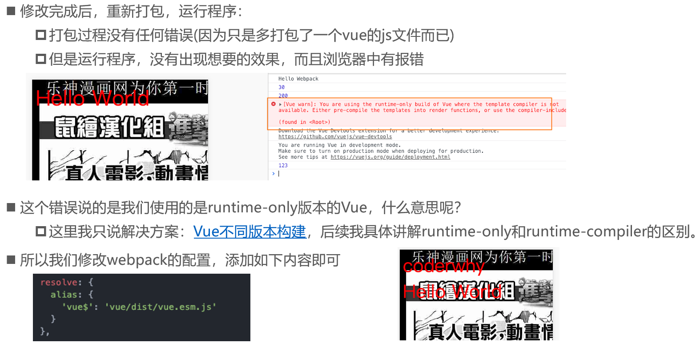


### el和template区别


---

### Vue组件化开发引入


### .vue文件封装处理


```
npm install vue-loader vue-template-compiler --save-dev
```


---

## 10.plugin的使用

### 认识plugin


### 添加版权的Plugin


### 打包html的plugin


```
npm install html-webpack-plugin --save-dev
```


---

### js压缩的Plugin


```
npm install uglifyjs-webpack-plugin@1.1.1 --save-dev
```

---

## 11.搭建本地服务器


```
npm install --save-dev webpack-dev-server@2.9.1
```


运行

```
npm run dev
```

---

## 12.配置文件的分离

目的：将开发配置和发布配置分离

1.安装插件

```
npm install webpack-merge --save-dev
```

2.新建配置文件


注意：base配置中要指定合适的path


---

3.指定使用合适的配置文件


4.使用

```
npm run dev
npm run build
```

----

# 六、Vue CLI详解

[官网](https://cli.vuejs.org/zh/guide/)

## 1.Vue CLI

### 什么是Vue CLI


### Vue CLI使用前提 - Node


```
npm install -g cnpm --registry=https://registry.npm.taobao.org
cnpm install [name]
```

---

### Vue CLI使用前提 - Webpack


```
npm install webpack -g
```

### Vue CLI的使用


```
npm install -g @vue/cli

npm install -g @vue/cli-init

vue init webpack my-project

vue create my-project
```

---

## 2.     **Vue** **CLI2**  

### Vue CLI2详解

nVue CLI2初始化项目

```
vue init webpack vuecli2test
```


---

### 目录结构详解


---

### 停止使用Eslint

```
vue init webpack runtimecompiler
```


```
vue init webpack runtimeonly
```


---

停止使用Eslint


---

### render和template

Runtime-Compiler和Runtime-only的区别


### render函数的使用


--01-runtimecompiler/src/main.js

```js
import Vue from 'vue'
import App from './App'

Vue.config.productionTip = false

/* eslint-disable no-new */
// const cpn = {
//   template: '<div>{{message}}</div>',
//   data() {
//     return {
//       message: '我是组件message'
//     }
//   }
// }

new Vue({
  el: '#app',
  render: function (createElement) {
    // 1.普通用法: createElement('标签', {标签的属性}, [''])
    // return createElement('h2',
    //   {class: 'box'},
    //   ['Hello World', createElement('button', ['按钮'])])

    // 2.传入组件对象:
    return createElement(App)
  }
})


// runtime-compiler(v1)
// template -> ast -> render -> vdom -> UI

// runtime-only(v2)(1.性能更高 2.下面的代码量更少)
// render -> vdom -> UI

```

--02-runtimeonly/src/main.js

```js
import Vue from 'vue'
import App from './App'

Vue.config.productionTip = false

console.log(App);

/* eslint-disable no-new */
new Vue({
  el: '#app',
  render: function (h) {
    return h(App)
  }
})


// 那么.vue文件中的template是由谁处理的了?
// 是由vue-template-compiler
// render -> vdom -> UI

```

---

### npm run build


### npm run dev


---

---

## 3.     **Vue CLI3**  

### 认识Vue CLI3


###      **Vue** **CLI3**  

```
vue create testvuecli3
```


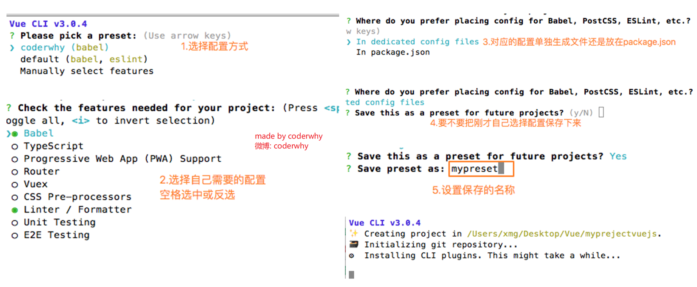


----

###      **目录结构详解**  


### 配置文件查看修改

####      **配置去哪里了？**  


####      **自定义配置：起别名**  

文件名是固定的：`vue.config.js`


---

## 4.箭头函数

### 基本使用

--01-箭头函数的基本使用.html

```html
<!DOCTYPE html>
<html lang="en">
<head>
  <meta charset="UTF-8">
  <title>Title</title>
</head>
<body>

<script>
  // 箭头函数: 也是一种定义函数的方式
  // 1.定义函数的方式: function
  const aaa = function () {

  }

  // 2.对象字面量中定义函数
  const obj = {
    bbb() {

    }
  }

  // 3.ES6中的箭头函数
  // const ccc = (参数列表) => {
  //
  // }
  const ccc = () => {

  }

</script>
</body>
</html>
```


### 函数参数和返回值

--02-箭头函数参数和返回值.html

```html
<!DOCTYPE html>
<html lang="en">
<head>
  <meta charset="UTF-8">
  <title>Title</title>
</head>
<body>


<script>
  // 1.参数问题:
  // 1.1.放入两个参数
  const sum = (num1, num2) => {
    return num1 + num2
  }

  // 1.2.放入一个参数
  const power = num => {
    return num * num
  }

  // 2.函数中
  // 2.1.函数代码块中有多行代码时
  const test = () => {
    // 1.打印Hello World
    console.log('Hello World');

    // 2.打印Hello Vuejs
    console.log('Hello Vuejs');
  }

  // 2.2.函数代码块中只有一行代码
  // const mul = (num1, num2) => {
  //   return num1 + num2
  // }
  const mul = (num1, num2) => num1 * num2
  console.log(mul(20, 30));

  // const demo = () => {
  //   console.log('Hello Demo');
  // }
  const demo = () => console.log('Hello Demo')
  console.log(demo());


</script>
</body>
</html>
```

### this的使用

--03-箭头函数中的this的使用.html

```html
<!DOCTYPE html>
<html lang="en">
<head>
  <meta charset="UTF-8">
  <title>Title</title>
</head>
<body>

<script>
  // 什么时候使用箭头
  // setTimeout(function () {
  //   console.log(this);
  // }, 1000)
  //
  // setTimeout(() => {
  //   console.log(this);
  // }, 1000)

  // 问题: 箭头函数中的this是如何查找的了?
  // 答案: 向外层作用域中, 一层层查找this, 直到有this的定义.
  // const obj = {
  //   aaa() {
  //     setTimeout(function () {
  //       console.log(this); // window
  //     })
  //
  //     setTimeout(() => {
  //       console.log(this); // obj对象
  //     })
  //   }
  // }
  //
  // obj.aaa()


  const obj = {
    aaa() {
      setTimeout(function () {
        setTimeout(function () {
          console.log(this); // window
        })

        setTimeout(() => {
          console.log(this); // window
        })
      })

      setTimeout(() => {
        setTimeout(function () {
          console.log(this); // window
        })

        setTimeout(() => {
          console.log(this); // obj
        })
      })
    }
  }

  obj.aaa()
</script>
</body>
</html>
```

---

# 七、vue-router详解

创建项目


## 1.认识路由

### 什么是路由？


###      **后端路由阶段**  


###      **前端路由阶段**  


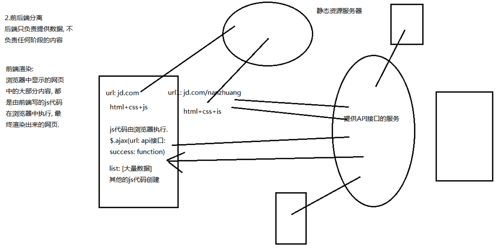


---

## 2.前端路由的规则

### URL的hash


### HTML5的history模式

#### pushState


####      r**eplaceState**  

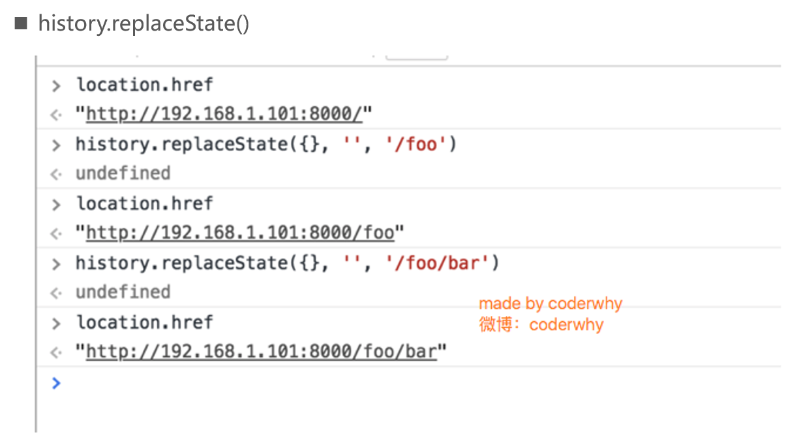

####      go  


---

## 3.vue-router基础

### 认识vue-router

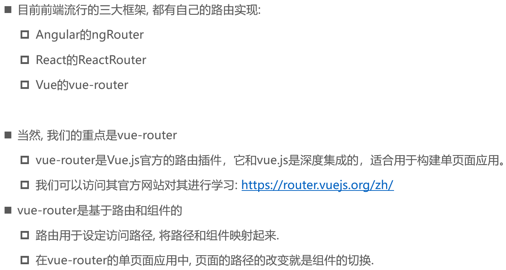

### 安装和使用vue-router


### 创建router实例


### 挂载到Vue实例中

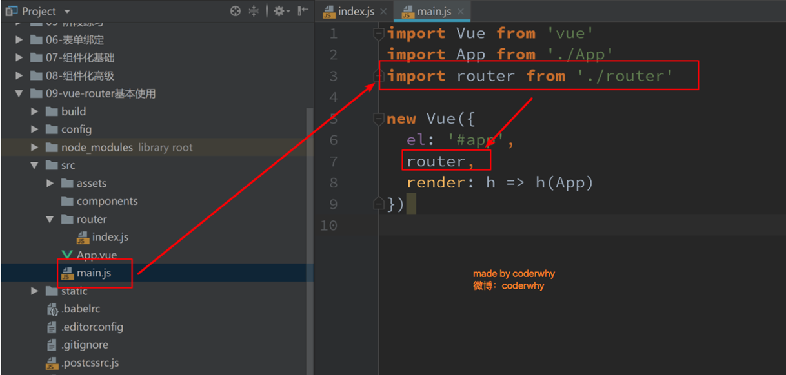

---

### 步骤一：创建路由组件


### 步骤二：配置组件和路径的映射关系


###      **步骤三：**使用路由


###      **最终效果如下**  


## 4.细节处理

### 路由的默认路径


### HTML5的History模式


### router-link补充


### 修改linkActiveClass


### 路由代码跳转


----

--main.js

```js
import Vue from 'vue'
import App from './App'
// 默认会在router目录下找index文件
import router from './router'

Vue.config.productionTip = false

new Vue({
  el: '#app',
  router,
  render: h => h(App)
})

```

--index.js

```js
// 配置路由相关的信息
import VueRouter from 'vue-router'
import Vue from 'vue'

import Home from '../components/Home'
import About from '../components/About'

// 1.通过Vue.use(插件), 安装插件
Vue.use(VueRouter)

// 2.创建VueRouter对象
const routes = [
  {
    path: '',
    // redirect重定向
    redirect: '/home'
  },
  {
    path: '/home',
    component: Home
  },
  {
    path: '/about',
    component: About
  }
]
const router = new VueRouter({
  // 配置路由和组件之间的应用关系
  routes,
  mode: 'history',
  linkActiveClass: 'active'
})

// 3.将router对象传入到Vue实例
export default router


```

--App.vue

```vue
<template>
  <div id="app">
    <h2>我是APP组件</h2>
    <!--<router-link to="/home" tag="button" replace active-class="active">首页</router-link>-->
    <!--<router-link to="/about" tag="button" replace active-class="active">关于</router-link>-->
    <!--<router-link to="/home" tag="button" replace>首页</router-link>-->
    <!--<router-link to="/about" tag="button" replace>关于</router-link>-->
    <button @click="homeClick">首页</button>
    <button @click="aboutClick">关于</button>
    <router-view></router-view>
  </div>
</template>

<script>
  export default {
    name: 'App',
    methods: {
      homeClick() {
        // 通过代码的方式修改路由 vue-router
        // push => pushState
        // this.$router.push('/home')
        // 所有的vue实例中都有$router这个属性
        this.$router.replace('/home')
        console.log('homeClick');
      },
      aboutClick() {
        // this.$router.push('/about')
        this.$router.replace('/about')
        console.log('aboutClick');
      }
    }
  }
</script>

<style>
  /*.router-link-active {*/
  /*color: #f00;*/
  /*}*/

  .active {
    color: #f00;
  }
</style>

```

### 动态路由


注意：$router与$route的区别


效果：


---

## 5.路由懒加载

```
npm run build
```


###      **认识路由的懒加载**  

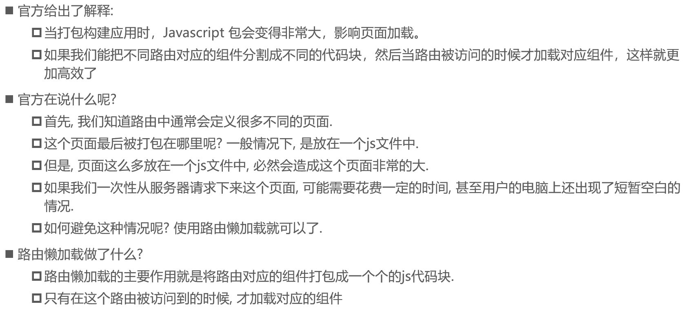

###      **路由懒加载的效果**  


###      **懒加载的方式**  

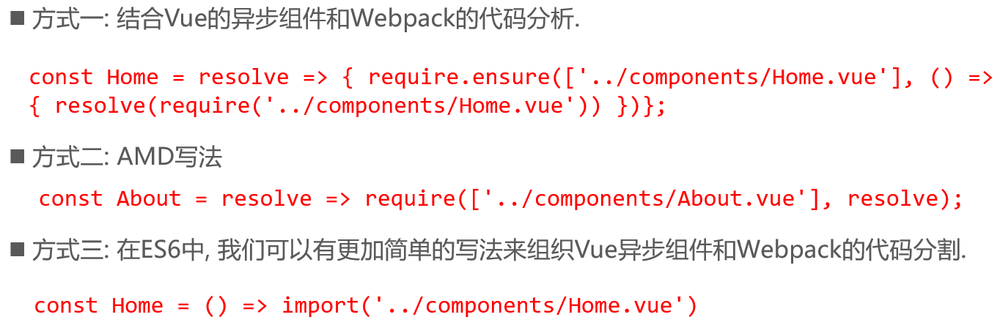


效果


---

## 6.路由嵌套

###      **认识嵌套路由**  


###      **嵌套路由实现**  


###      **嵌套默认路径**  


----


---

## 7.传递参数

###      **准备工作**  


###      **传递参数的方式**  


### 传递参数方式一

<router-link>


###      **传递参数方式二**  

JavaScript代码


###      **获取参数**  


---


---

### $route和$router是有区别的


---

## 8.导航守卫

### 为什么使用导航守卫?


​     普通的修改方式  


###      **导航守卫使用**  


---

--index.js

```js
// 配置路由相关的信息
import VueRouter from 'vue-router'
import Vue from 'vue'

// import Home from '../components/Home'
// import About from '../components/About'
// import User from '../components/User'

// 懒加载
const Home = () => import('../components/Home')
const HomeNews = () => import('../components/HomeNews')
const HomeMessage = () => import('../components/HomeMessage')

const About = () => import('../components/About')
const User = () => import('../components/User')
const Profile = () => import('../components/Profile')

// 1.通过Vue.use(插件), 安装插件
Vue.use(VueRouter)

// 2.创建VueRouter对象
const routes = [
  {
    path: '',
    // redirect重定向
    redirect: '/home'
  },
  {
    path: '/home',
    component: Home,
    meta: {
      title: '首页'
    },
    children: [
      {
        path: '',
        redirect: 'news'
      },
      {
        path: 'news',
        component: HomeNews
      },
      {
        path: 'message',
        component: HomeMessage
      }
    ]
  },
  {
    path: '/about',
    component: About,
    meta: {
      title: '关于'
    },
  },
  {
    path: '/user/:abc',
    component: User,
    meta: {
      title: '用户'
    },
  },
  {
    path: '/profile',
    component: Profile,
    meta: {
      title: '档案'
    },
  }
]
const router = new VueRouter({
  // 配置路由和组件之间的应用关系
  routes,
  mode: 'history',
  linkActiveClass: 'active'
})

// 前置守卫(guard)
router.beforeEach((to, from, next) => {
  // 从from跳转到to
  document.title = to.matched[0].meta.title
  // console.log(to);
  // console.log('++++');
  next()
})
// 3.将router对象传入到Vue实例
export default router


```


---

###      **导航守卫补充**  


[官网](https://router.vuejs.org/zh/guide/advanced/navigation-guards.html#%E8%B7%AF%E7%94%B1%E7%8B%AC%E4%BA%AB%E7%9A%84%E5%AE%88%E5%8D%AB)


---

## 9.     **keep-alive**  


---

实现以下功能


---

如果某个组件不想被缓存


----

## 10.TabBar练习

### TabBar实现思路


###      **代码实现**  


### 具体实现

```
vue init webpack tabbar
```


---

### 基本结构的搭建

--base.css

```css
body {
  padding: 0;
  margin: 0;
}

```

--App.vue

```vue
<template>
  <div id="app">
    <div id="tab-bar">
      <div class="tab-bar-item">首页</div>
      <div class="tab-bar-item">分类</div>
      <div class="tab-bar-item">购物车</div>
      <div class="tab-bar-item">我的</div>

    </div>
  </div>
</template>

<script>
export default {
  name: 'App'
}
</script>

<style>
  @import "./assets/css/base.css";
  #tab-bar {
    /*平行分布*/
    display: flex;
    /*加背景色*/
    background-color: #f6f6f6;

    position: fixed;
    left: 0;
    right: 0;
    bottom: 0;

    /*过度阴影*/
    box-shadow: 0 -1px 1px rgba(100,100,100,0.2);
  }
  /*等距分布*/
  .tab-bar-item {
    flex: 1;
    /*居中*/
    text-align: center;
    height: 49px;
  }

</style>

```

---

### TabBar和TabBarItem组件封装

--TabBarItem

```vue
<template>
  <!--所有的item都展示同一个图片, 同一个文字-->
  <div class="tab-bar-item">
    <slot name="item-icon"></slot>
    <slot name="item-text"></slot>
<!--    <div class="tab-bar-item">-->
<!--      -->
<!--      <div>首页</div>-->
<!--    </div>-->
  </div>
</template>

<script>
  export default {
    name: "TabBarItem"
  }
</script>

<style scoped>

  /*等距分布*/
  .tab-bar-item {
    flex: 1;
    /*居中*/
    text-align: center;
    height: 49px;
    /*改变字体大小*/
    font-size: 14px;
  }

  /*设置图标大小*/
  .tab-bar-item img {
    width: 24px;
    height: 24px;
    /*上边距*/
    margin-top: 3px;
    /*取消图片下方的空隙（图片下方默认有3像素空袭）*/
    vertical-align: middle;
    /*设置元素的下外边距*/
    margin-bottom: 2px;
  }
</style>

```

--TabBar

```vue
<template>
  <div id="tab-bar">
    <slot></slot>
  </div>
</template>

<script>
  export default {
    name: "TabBar"
  }
</script>

<style scoped>
  #tab-bar {
    /*平行分布*/
    display: flex;
    /*加背景色*/
    background-color: #f6f6f6;

    position: fixed;
    left: 0;
    right: 0;
    bottom: 0;
    /*过度阴影*/
    box-shadow: 0 -1px 1px rgba(100,100,100,0.2);
  }
</style>


```

--App

```vue
<template>
  <div id="app">
    <tab-bar>
      <tab-bar-item>
        
        <div slot="item-text">首页</div>
      </tab-bar-item>
      <tab-bar-item>
        
        <div slot="item-text">分类</div>
      </tab-bar-item>
      <tab-bar-item>
        
        <div slot="item-text">购物车</div>
      </tab-bar-item>
      <tab-bar-item>
        
        <div slot="item-text">我的</div>
      </tab-bar-item>
    </tab-bar>
  </div>
</template>

<script>
  import TabBar from "./components/tabbar/TabBar";
  import TabBarItem from "./components/tabbar/TabBarItem";

export default {
  name: 'App',
  components: {
    TabBar,
    TabBarItem
  }
}
</script>

<style>
  @import "./assets/css/base.css";
</style>

```

---


---

### 给TabBarItem传入active图片

--TabBarItem

```vue
<template>
  <!--所有的item都展示同一个图片, 同一个文字-->
  <div class="tab-bar-item">
<!--    这里用div标签将slot插槽包裹，是因为之后slot会被完全取代，样式会不起作用-->
    <div v-if="!isActive"><slot name="item-icon"></slot></div>
    <div v-else><slot name="item-icon-active"></slot></div>
    <div :class="{active: isActive}"><slot name="item-text"></slot></div>
  </div>
</template>

<script>
  export default {
    name: "TabBarItem",
    data() {
      return {
        isActive: false
      }
    },
  }
</script>

<style scoped>

  /*等距分布*/
  .tab-bar-item {
    flex: 1;
    /*居中*/
    text-align: center;
    height: 49px;
    /*改变字体大小*/
    font-size: 14px;
  }

  /*设置图标大小*/
  .tab-bar-item img {
    width: 24px;
    height: 24px;
    /*上边距*/
    margin-top: 3px;
    /*取消图片下方的空隙（图片下方默认有3像素空袭）*/
    vertical-align: middle;
    /*设置元素的下外边距*/
    margin-bottom: 2px;
  }

  .active {
    color: red;
  }

</style>

```

---


---

### 结合路由

--index.js

```js
import Vue from 'vue'
import VueRouter from 'vue-router'

const Home = () => import('../views/home/Home')
const Category = () => import('../views/category/Category')
const Cart = () => import('../views/cart/Cart')
const Profile = () => import('../views/profile/Profile')

// 1.安装插件
Vue.use(VueRouter)

// 2.创建路由对象
const routes = [
  {
    path: '',
    redirect: '/home'
  },
  {
    path: '/home',
    component: Home
  },
  {
    path: '/category',
    component: Category
  },
  {
    path: '/cart',
    component: Cart
  },
  {
    path: '/profile',
    component: Profile
  }
]
const router = new VueRouter({
  routes,
  mode: 'history'
})

// 3.导出router
export default router

```

---


---

### TabBarItem颜色动态控制

--TabBarItem

```vue
<template>
  <!--所有的item都展示同一个图片, 同一个文字-->
  <div class="tab-bar-item" @click="itemClick">
<!--    这里用div标签将slot插槽包裹，是因为之后slot会被完全取代，样式会不起作用-->
    <div v-if="!isActive"><slot name="item-icon"></slot></div>
    <div v-else><slot name="item-icon-active"></slot></div>
    <div :style="activeStyle"><slot name="item-text"></slot></div>
  </div>
</template>

<script>
  export default {
    name: "TabBarItem",
    props: {
      path: String,
      activeColor: {
        type: String,
        default: 'red'
      }
    },
    data() {
      return {
        // isActive: false
      }
    },
    computed: {
      isActive() {
        // /home -> item1(/home) = true
        // /home -> item1(/category) = false
        // /home -> item1(/cart) = true
        // /home -> item1(/profile) = true
        // 当前激活的路径是不是this.path，-1代表不是
        return this.$route.path.indexOf(this.path) !== -1
      },
      activeStyle() {
        // 三目运算
        return this.isActive ? {color: this.activeColor} : {}
      }
    },
    methods: {
      itemClick() {
        this.$router.replace(this.path).catch(err => {err})
        console.log(this.path);
      }
    }
  }
</script>

<style scoped>

  /*等距分布*/
  .tab-bar-item {
    flex: 1;
    /*居中*/
    text-align: center;
    height: 49px;
    /*改变字体大小*/
    font-size: 14px;
  }

  /*设置图标大小*/
  .tab-bar-item img {
    width: 24px;
    height: 24px;
    /*上边距*/
    margin-top: 3px;
    /*取消图片下方的空隙（图片下方默认有3像素空袭）*/
    vertical-align: middle;
    /*设置元素的下外边距*/
    margin-bottom: 2px;
  }
</style>

```

1.完成点击图标颜色变化


2.完成动态地传入颜色


---

### 进一步抽象

--MainTabBar

```vue
<template>
  <div>
    <tab-bar>
      <tab-bar-item path="/home" active-color="blue">
        
        
        <div slot="item-text">首页</div>
      </tab-bar-item>
      <tab-bar-item path="/Category" active-color="red">
        
        
        <div slot="item-text">分类</div>
      </tab-bar-item>
      <tab-bar-item path="/Cart" active-color="green">
        
        
        <div slot="item-text">购物车</div>
      </tab-bar-item>
      <tab-bar-item path="Profile"active-color="orange">
        
        
        <div slot="item-text">我的</div>
      </tab-bar-item>
    </tab-bar>
  </div>

</template>

<script>

  import TabBar from "./tabbar/TabBar";
  import TabBarItem from "./tabbar/TabBarItem";
  export default {
    name: "MainTabBar",
    components: {
      TabBar,
      TabBarItem
    }
  }
</script>

<style scoped>

</style>

```

--App

```vue
<template>
  <div id="app">
    <router-view></router-view>
    <MainTabBar/>
  </div>
</template>

<script>
  import MainTabBar from "./components/MainTabBar";

export default {
  name: 'App',
  components: {
    MainTabBar
  }

}
</script>

<style>
  @import "./assets/css/base.css";
</style>

```

---


---

## 11.给路径起别名


使用：

1. import可以直接使用
2. 'src='需要在前面加上‘~’


---

# 八、Promise的使用

## 1.认识Promise

### 什么是Promise呢？

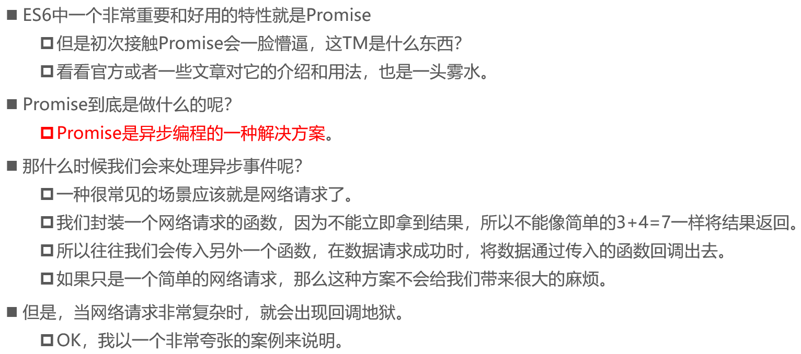

### 网络请求的回调地狱


## 2.Promise的基本使用

###      **定时器的异步事件**  


###      **定时器异步事件解析**  


---

--01-Promise的基本使用.html

```html
<!DOCTYPE html>
<html lang="en">
<head>
  <meta charset="UTF-8">
  <title>Title</title>
</head>
<body>

<script>
  // 1.使用setTimeout
  // setTimeout(() => {
  //   console.log('Hello World');
  // }, 1000)

  // 什么情况下会用到Promise?
  // 一般情况下是有异步操作时,使用Promise对这个异步操作进行封装
  // new -> 构造函数(1.保存了一些状态信息  2.执行传入的函数)
  // 在执行传入的回调函数时, 会传入两个参数, resolve, reject.本身又是函数
  new Promise((resolve, reject) => {
    setTimeout(() => {
      // 成功的时候调用resolve
      // resolve('Hello World')

      // 失败的时候调用reject
      reject('error message')
    }, 1000)
  }).then((data) => {
    // 1.100行的处理代码
    console.log(data);
    console.log(data);
    console.log(data);
    console.log(data);
    console.log(data);
  }).catch((err) => {
    console.log(err);
  })
</script>
</body>
</html>
```

---

### Promise三种状态


--02-Promise的另外处理形式.html

```html
<!DOCTYPE html>
<html lang="en">
<head>
  <meta charset="UTF-8">
  <title>Title</title>
</head>
<body>

<script>
  new Promise((resolve, reject) => {
    setTimeout(() => {
      // resolve('Hello Vuejs')
      reject('error message')
    }, 1000)
  }).then(data => {
    console.log(data);
  }, err => {
    console.log(err);
  })
</script>
</body>
</html>
```

---

## 3.Promise链式调用

### Promise链式调用


### 链式调用简写


---

--03-Promise的链式调用(一).html

```html
<!DOCTYPE html>
<html lang="en">
<head>
  <meta charset="UTF-8">
  <title>Title</title>
</head>
<body>


<script>


  // 参数 -> 函数(resolve, reject)
  // resolve, reject本身它们又是函数
  // 链式编程
  new Promise((resolve, reject) => {

    // 第一次网络请求的代码
    setTimeout(() => {
      resolve()
    }, 1000)

  }).then(() => {
    // 第一次拿到结果的处理代码
    console.log('Hello World');
    console.log('Hello World');
    console.log('Hello World');
    console.log('Hello World');
    console.log('Hello World');
    console.log('Hello World');

    return new Promise((resolve, reject) => {

      // 第二次网络请求的代码
      setTimeout(() => {
        resolve()
      }, 1000)
    })
  }).then(() => {

    // 第二次处理的代码
    console.log('Hello Vuejs');
    console.log('Hello Vuejs');
    console.log('Hello Vuejs');
    console.log('Hello Vuejs');
    console.log('Hello Vuejs');
    console.log('Hello Vuejs');

    return new Promise((resolve, reject) => {

      // 第三次网络请求的代码
      setTimeout(() => {
        resolve()
      })
    })
  }).then(() => {

    // 第三处理的代码
    console.log('Hello Python');
    console.log('Hello Python');
    console.log('Hello Python');
    console.log('Hello Python');
    console.log('Hello Python');
  })
</script>
</body>
</html>
```

--04-Promise的链式调用(二).html

```html
<!DOCTYPE html>
<html lang="en">
<head>
  <meta charset="UTF-8">
  <title>Title</title>
</head>
<body>

<script>
  // 请求一:
  let isResult1 = false
  let isResult2 = false
  $ajax({
    url: '',
    success: function () {
      console.log('结果1');
      isResult1 = true
      handleResult()
    }
  })
  // 请求二:
  $ajax({
    url: '',
    success: function () {
      console.log('结果2');
      isResult2 = true
      handleResult()
    }
  })

  function handleResult() {
    if (isResult1 && isResult2) {
      //
    }
  }

  // wrapped into
  // 网络请求: aaa -> 自己处理(10行)
  // 处理: aaa111 -> 自己处理(10行)
  // 处理: aaa111222 -> 自己处理
  // new Promise((resolve, reject) => {
  //   setTimeout(() => {
  //     resolve('aaa')
  //   }, 1000)
  // }).then(res => {
  //   // 1.自己处理10行代码
  //   console.log(res, '第一层的10行处理代码');
  //
  //   // 2.对结果进行第一次处理
  //   return new Promise((resolve, reject) => {
  //     // resolve(res + '111')
  //     reject('err')
  //   })
  // }).then(res => {
  //   console.log(res, '第二层的10行处理代码');
  //
  //   return new Promise(resolve => {
  //     resolve(res + '222')
  //   })
  // }).then(res => {
  //   console.log(res, '第三层的10行处理代码');
  // }).catch(err => {
  //   console.log(err);
  // })

  // new Promise(resolve => resolve(结果))简写
  new Promise((resolve, reject) => {
    setTimeout(() => {
      resolve('aaa')
    }, 1000)
  }).then(res => {
    // 1.自己处理10行代码
    console.log(res, '第一层的10行处理代码');

    // 2.对结果进行第一次处理
    return Promise.resolve(res + '111')
  }).then(res => {
    console.log(res, '第二层的10行处理代码');

    return Promise.resolve(res + '222')
  }).then(res => {
    console.log(res, '第三层的10行处理代码');
  })

  // 省略掉Promise.resolve
  new Promise((resolve, reject) => {
    setTimeout(() => {
      resolve('aaa')
    }, 1000)
  }).then(res => {
    // 1.自己处理10行代码
    console.log(res, '第一层的10行处理代码');

    // 2.对结果进行第一次处理
    return res + '111'
  }).then(res => {
    console.log(res, '第二层的10行处理代码');

    return res + '222'
  }).then(res => {
    console.log(res, '第三层的10行处理代码');
  })


  new Promise((resolve, reject) => {
    setTimeout(() => {
      resolve('aaa')
    }, 1000)
  }).then(res => {
    // 1.自己处理10行代码
    console.log(res, '第一层的10行处理代码');

    // 2.对结果进行第一次处理
    // return Promise.reject('error message')
    throw 'error message'
  }).then(res => {
    console.log(res, '第二层的10行处理代码');

    return Promise.resolve(res + '222')
  }).then(res => {
    console.log(res, '第三层的10行处理代码');
  }).catch(err => {
    console.log(err);
  })
</script>
</body>
</html>
```

同时处理两个网络请求

--05-Promise的all方法使用.html

```html
<!DOCTYPE html>
<html lang="en">
<head>
  <meta charset="UTF-8">
  <title>Title</title>
</head>
<body>

<script>
  // 请求二一:
  // let isResult1 = false
  // let isResult2 = false
  // $ajax({
  //   url: '',
  //   success: function () {
  //     console.log('结果1');
  //     isResult1 = true
  //     handleResult()
  //   }
  // })
  // // 请求二:
  // $ajax({
  //   url: '',
  //   success: function () {
  //     console.log('结果2');
  //     isResult2 = true
  //     handleResult()
  //   }
  // })
  //
  // function handleResult() {
  //   if (isResult1 && isResult2) {
  //     //
  //   }
  // }


  Promise.all([
      // new Promise((resolve, reject) => {
      //   $.ajax({
      //     url: 'url1',
      //     success: function (data) {
      //       resolve(data)
      //     }
      //   })
      // }),
      // new Promise((resolve, reject) => {
      //   $.ajax({
      //     url: 'url2',
      //     success: function (data) {
      //       resolve(data)
      //     }
      //   })
      // })

    new Promise((resolve, reject) => {
      setTimeout(() => {
        resolve({name: 'why', age: 18})
      }, 2000)
    }),
    new Promise((resolve, reject) => {
      setTimeout(() => {
        resolve({name: 'kobe', age: 19})
      }, 1000)
    })
  ]).then(results => {
    console.log(results);
  })
</script>
</body>
</html>
```

---

# 九、Vuex详解

## 1.认识Vuex

### Vuex是做什么的?


### 管理什么状态呢?


###      **单界面的状态管理**  


###      **单界面状态管理的实现**  


###      **多界面状态管理**  


### Vuex状态管理图例


---

## 2.Vuex基本使用

### 安装Vuex

```
npm install vuex --save
```

###      **简单的案例**  


### 挂载到Vue实例中


### 使用Vuex的count


---

## 3.Vuex核心概念

```
Vuex有几个比较核心的概念:
    State
    Getters
    Mutation
    Action
    Module
```

###      State单一状态树


###      **Getters**  

#### Getters基本使用


#### Getters作为参数和传递参数


---


---

###      **Mutation**  

#### Mutation状态更新


#### Mutation传递参数


#### Mutation提交风格


---


---

#### Mutation响应规则


---


---

#### Mutation常量类型 


---


---

#### Mutation同步函数

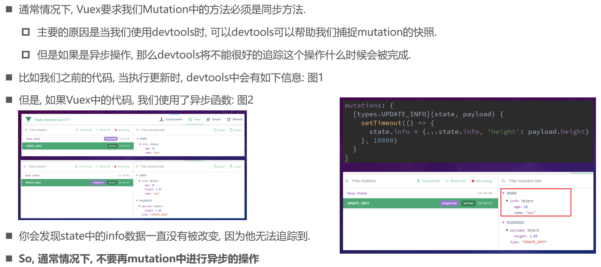


---

###      **Action**  

#### Action的基本定义


#### Action的分发


#### Action返回的Promise


---

--index.js

```js
actions: {
    // aUpdateInfo(context) {
    //   setTimeout(() => {
    //     context.commit('updateInfo')
    //     },1000)
    // },

    // aUpdateInfo(context, payload) {
    //   setTimeout(() => {
    //     context.commit('updateInfo')
    //     console.log(payload.message);
    //     payload.success()
    //   }, 1000)
    // },
    
    aUpdateInfo(context,payload) {
      // setTimeout(() => {
      //   context.commit('updateInfo')
      //   console.log(payload);
      // },1000)


      return new Promise((resolve, reject) => {
        setTimeout(() => {
          context.commit('updateInfo');
          console.log(payload);

          resolve('1111111')
        }, 1000)
      })
    },
  },
```

--App.vue

```js
// updateInfo() {
    //   // this.$store.commit('updateInfo')
    //   // this.$store.dispatch('aUpdateInfo')
    //   this.$store.dispatch('aUpdateInfo','test')
    // },
    updateInfo() {
      // this.$store.commit('updateInfo')
      // this.$store.dispatch('aUpdateInfo', {
      //   message: '我是携带的信息',
      //   success: () => {
      //     console.log('里面已经完成了');
      //   }
      // })
      this.$store
        .dispatch('aUpdateInfo', '我是携带的信息')
        .then(res => {
          console.log('里面完成了提交');
          console.log(res);
        })
    },
```


---

###      **Module**  

#### 认识Module


#### Module局部状态


#### Actions的写法


---

--index.js

```js
const moduleA = {
  state: {
    name: 'zhangsan'
  },
  mutations: {
    updateName(state, payload) {
      state.name = payload
    }
  },
  getters: {
    fullname(state) {
      return state.name + '11111'
    },
    fullname2(state, getters) {
      return getters.fullname + '2222'
    },
    fullname3(state, getters, rootState) {
      return getters.fullname2 + rootState.counter
    }
  },
  actions: {
    aUpdateName(context) {
      console.log(context);
      setTimeout(() => {
        context.commit('updateName', 'wangwu')
      }, 1000)
    }
  }
}
```

--App.vue

```html
<h2>----------App内容: modules中的内容----------</h2>
    <h2>{{$store.state.a.name}}</h2>
    <button @click="updateName">修改名字</button>
    <h2>{{$store.getters.fullname}}</h2>
    <h2>{{$store.getters.fullname2}}</h2>
    <h2>{{$store.getters.fullname3}}</h2>

    <button @click="asyncUpdateName">异步修改名字</button>
```

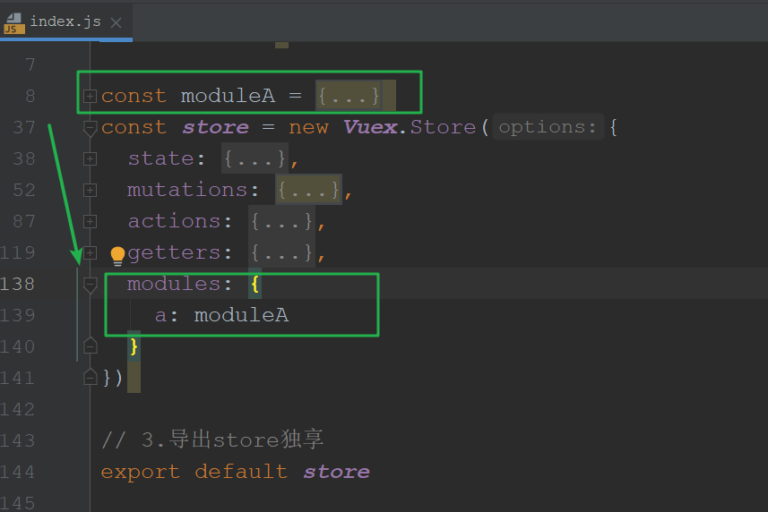


---

对象的解构

```js
// 对象的解构
const obj = {
  name: 'why',
  age: 18,
  height: 1.88,
  address: '洛杉矶'
}

const {name, height, age} = obj;

```

---

###      **项目结构**  

​     当我们的Vuex帮助我们管理过多的内容时, 好的项目结构可以让我们的代码更加清晰  


---

# 十、网络模块封装

## 1.模块的选择

### 选择什么网络模块?


## 2.     **jsonp**  封装

###      **jsonp**  


### JSONP封装


## 3.认识 **axios**  

### 为什么选择axios?


### axiox请求方式


## 4.发生基本基本请求

### 发送get请求演示


###      **发送并发请求**  


###      **全局配置**  


###      **常见的配置选项**  


## 5.     **axios**  实例

### axios的实例


### axios封装


---

## 6.拦截器

### 如何使用拦截器？


### 拦截器中都做什么呢？


---

## 7.具体代码展示

创建项目

```
vue init webpack learnaxios
```

安装axios

```
npm install axios --save
```


---

使用axios

--main.js

```js
import Vue from 'vue'
import App from './App'
// 引入axios
import axios from 'axios'

Vue.config.productionTip = false

/* eslint-disable no-new */
new Vue({
  el: '#app',
  render: h => h(App)
})

// 1.axios的基本使用
axios({
  url: 'http://123.207.32.32:8000/home/multidata',
  // method: 'post'
}).then(res => {
  console.log(res);
})

axios({
  // url: 'http://123.207.32.32:8000/home/data?type=pop&page=1'
  url: 'http://123.207.32.32:8000/home/data',
  // 专门针对get请求的参数拼接
  params: {
    type: 'pop',
    page: 1
  }
}).then(res => {
  console.log(res);
})

// 2.axios发送并发请求
axios.all([axios({
  url: 'http://123.207.32.32:8000/home/multidata'
}), axios({
  url: 'http://123.207.32.32:8000/home/data',
  params: {
    type: 'sell',
    page: 5
  }
})]).then(results => {
  console.log(results);
  console.log(results[0]);
  console.log(results[1]);
})

// 3.使用全局的axios和对应的配置在进行网络请求
axios.defaults.baseURL = 'http://123.207.32.32:8000'
axios.defaults.timeout = 5000

axios.all([axios({
  url: '/home/multidata'
}), axios({
  url: '/home/data',
  params: {
    type: 'sell',
    page: 5
  }
})]).then(axios.spread((res1, res2) => {
  console.log(res1);
  console.log(res2);
}))

// 一般不使用全局的axios和对应的配置，因为baseURL可能不同
// axios.defaults.baseURL = 'http://222.111.33.33:8000'
// axios.defaults.timeout = 10000

axios({
  url: 'http://123.207.32.32:8000/category'
})

// 4.创建对应的axios的实例
const instance1 = axios.create({
  baseURL: 'http://123.207.32.32:8000',
  timeout: 5000
})

instance1({
  url: '/home/multidata'
}).then(res => {
  console.log(res);
})

instance1({
  url: '/home/data',
  params: {
    type: 'pop',
    page: 1
  }
}).then(res => {
  console.log(res);
})


const instance2 = axios.create({
  baseURL: 'http://222.111.33.33:8000',
  timeout: 10000,
  // headers: {}
})


// 5.封装request模块
import {request} from "./network/request";

// 下面是各种函数回调的方式
// request({
//   url: '/home/multidata'
// }, res => {
//   console.log(res);
// }, err => {
//   console.log(err);
// })

// request({
//   baseConfig: {
//
//   },
//   success: function (res) {
//
//   },
//   failure: function (err) {
//
//   }
// })

request({
  url: '/home/multidata'
}).then(res => {
  console.log(res);
}).catch(err => {
  // console.log(err);
})

```

---

封装axios

--request.js

```js
import axios from 'axios'

export function request(config) {
  // 1.创建axios的实例
  const instance = axios.create({
    baseURL: 'http://123.207.32.32:8000',
    timeout: 5000
  })

  // 2.axios的拦截器
  // 2.1.请求拦截的作用
  instance.interceptors.request.use(config => {
    // console.log(config);
    // 1.比如config中的一些信息不符合服务器的要求

    // 2.比如每次发送网络请求时, 都希望在界面中显示一个请求的图标

    // 3.某些网络请求(比如登录(token)), 必须携带一些特殊的信息
    return config
  }, err => {
    // console.log(err);
  })

  // 2.2.响应拦截
  instance.interceptors.response.use(res => {
    // console.log(res);
    return res.data
  }, err => {
    console.log(err);
  })

  // 3.发送真正的网络请求
  return instance(config)
}

// export function request(config) {
//   return new Promise((resolve, reject) => {
//     // 1.创建axios的实例
//     const instance = axios.create({
//       baseURL: 'http://123.207.32.32:8000',
//       timeout: 5000
//     })
//
//     // 发送真正的网络请求
//     instance(config)
//       .then(res => {
//         resolve(res)
//       })
//       .catch(err => {
//         reject(err)
//       })
//   })
// }

// export function request(config) {
//   // 1.创建axios的实例
//   const instance = axios.create({
//     baseURL: 'http://123.207.32.32:8000',
//     timeout: 5000
//   })
//
//   // 发送真正的网络请求
//   instance(config.baseConfig)
//     .then(res => {
//       // console.log(res);
//       config.success(res);
//     })
//     .catch(err => {
//       // console.log(err);
//       config.failure(err)
//     })
// }

// export function request(config, success, failure) {
//   // 1.创建axios的实例
//   const instance = axios.create({
//     baseURL: 'http://123.207.32.32:8000',
//     timeout: 5000
//   })
//
//   // 发送真正的网络请求
//   instance(config)
//     .then(res => {
//       // console.log(res);
//       success(res);
//     })
//     .catch(err => {
//       // console.log(err);
//       failure(err)
//     })
// }

// function test(aaa, bbb) {
//   // aaa('Hello World')
//   bbb('err message')
// }
//
// test(function (res) {
//   console.log(res);
// }, function (err) {
//   console.log(err);
// })

```

---

# 十一、项目实战

## 项目开发

### 1.项目创建

```
vue create supermall
```


```
npm install
```


---

### 2.划分目录结构

components中一般放公共组件

+ common 当前项目会使用的组件，下一个项目可能也会用到的组件
+ content 放置与当前业务相关的公共组件，只针对于当前的项目

common：放置一些公共的js文件

+ const.js：公共的常量就可以放在该文件中
+ utils.js：工具类，公共方法


----

### 3.css文件的引入


[normalize.css](https://github.com/necolas/normalize.css) :对浏览器的标签进行统一

base.css:公共样式

---

--base.css

```css
@import "./normalize.css";

/*:root -> 获取根元素html*/
:root {
  /*下面定义了变量*/
  --color-text: #666;
  --color-high-text: #ff5777;
  --color-tint: #ff8198;
  --color-background: #fff;
  --font-size: 14px;
  --line-height: 1.5;
}

*,
*::before,
*::after {
  margin: 0;
  padding: 0;
  box-sizing: border-box;
}

body {
  font-family: "Helvetica Neue",Helvetica,"PingFang SC","Hiragino Sans GB","Microsoft YaHei","微软雅黑",Arial,sans-serif;
  user-select: none; /* 禁止用户鼠标在页面上选中文字/图片等 */
  -webkit-tap-highlight-color: transparent; /* webkit是苹果浏览器引擎，tap点击，highlight背景高亮，color颜色，颜色用数值调节 */
  /*使用上面定义的变量*/
  background: var(--color-background);
  color: var(--color-text);
  /* rem vw/vh */
  width: 100vw;
}

a {
  color: var(--color-text);
  text-decoration: none;
}


.clear-fix::after {
  clear: both;
  content: '';
  display: block;
  width: 0;
  height: 0;
  visibility: hidden;
}

.clear-fix {
  zoom: 1;
}

.left {
  float: left;
}

.right {
  float: right;
}


```

----


----

### 4.vue.config和editorconfig

在脚手架3中设置别名的方法：

1. 创建文件`vue.config.js`

   ```js
   module.exports = {
     configureWebpack: {
       resolve: {
         alias: {
           // 内部默认：src:@
           'assets': '@/assets',
           'common': '@/common',
           'components': '@/components',
           'network': '@/network',
           'views': '@/views',
         }
       }
     }
   }
   ```

   

---

对代码做统一的风格：

--.editorconfig

```
root = true

[*]
charset = utf-8
indent_style = space
indent_size = 2
end_of_line = lf
insert_final_newline = true
trim_trailing_whitespace = true
```


---

### 5.tabbar引入和项目模块划分

引入之前已经写好的tabbar和mainTabbar组件

tabbar 可复用组件

mainTabbar 针对本项目业务的组件


---

安装vue-router

```
npm install vue-router --save
```

使用vue-router

--index.js

```js
import Vue from 'vue'
import VueRouter from 'vue-router'

const Home = () => import('../views/home/Home')
const Category = () => import('../views/category/Category')
const Cart = () => import('../views/cart/Cart')
const Profile = () => import('../views/profile/Profile')

// 1.安装插件
Vue.use(VueRouter)

// 2.创建router
const routes = [
  {
    path: '',
    redirect: '/home'
  },
  {
    path: '/home',
    component: Home
  },
  {
    path: '/category',
    component: Category
  },
  {
    path: '/cart',
    component: Cart
  },
  {
    path: '/profile',
    component: Profile
  }
]
const router = new VueRouter({
  routes,
  mode: 'history'
})


export default router

```


---

引入之前写好的views页面


----

### 6.小图标的修改及路径问题


---

## 首页开发

### 1.首页导航栏的封装和使用

导航栏属于可复用的组件


--NavBar.vue

```vue
<template>
  <div class="nav-bar">
    <div class="left"><slot name="left"></slot></div>
    <div class="center"><slot name="center"></slot></div>
    <div class="right"><slot name="right"></slot></div>
  </div>
</template>

<script>
  export default {
    name: "NavBar"
  }
</script>

<style scoped>
  .nav-bar {
    display: flex;
    height: 44px;
    line-height: 44px;
    /*居中*/
    text-align: center;
    /*下面加阴影*/
    box-shadow: 0 1px 1px rgba(100,100,100,.1);
  }

  .left, .right {
    width: 60px;
  }

  .center {
    flex: 1;
  }
</style>

```

---

使用

--Home.vue

```vue
<template>
  <div id="home">
    <nav-bar class="home-nav"><div slot="center">购物街</div></nav-bar>
  </div>
</template>

<script>
  import NavBar from "components/common/navbar/NavBar";
  export default {
    name: "Home",
    components: {
      NavBar
    }
  }
</script>

<style scoped>
  .home-nav {
    background-color: var(--color-tint);
    /*文字颜色*/
    color: #fff;
  }
</style>

```


---

### 2.请求首页的多个数据

安装axios

```
npm install axios --save
```

---

封装axios


--request.js

```js
import axios from 'axios'

export function request(config) {
  // 1.创建axios的实例
  const instance = axios.create({
    baseURL: 'http://123.207.32.32:8000',
    timeout: 5000
  })

  // 2.axios的拦截器
  // 2.1.请求拦截的作用
  instance.interceptors.request.use(config => {
    return config
  }, err => {
    // console.log(err);
  })

  // 2.2.响应拦截
  instance.interceptors.response.use(res => {
    return res.data
  }, err => {
    console.log(err);
  })

  // 3.发送真正的网络请求
  // 返回的是promise
  return instance(config)
}

```

--home.js

```js
import {request} from "./request";

export function getHomeMultidata() {
  return request({
    url: '/home/multidata'
  })
}

// 函数调用 -> 压入函数栈(保存函数调用过程中所有变量)
// 函数调用结束 -> 弹出函数栈(释放函数所有的变量)
// function test() {
//   const names = ['why', 'aaa']
// }
//
// test()
//
// test()

```

---

使用


效果


---

### 3.轮播图的展示

轮播图的封装


--index.js

```js
import Swiper from './Swiper'
import SwiperItem from './SwiperItem'

export {
  Swiper, SwiperItem
}

```

----

使用


--HomeSwiper.vue

```vue
<template>
  <swiper>
    <swiper-item v-for="item in banners">
      <a :href="item.link">
        
      </a>
    </swiper-item>
  </swiper>
</template>

<script>
  import {Swiper, SwiperItem} from 'components/common/swiper'

  export default {
    name: "HomeSwiper",
    props: {
      banners: {
        type: Array,
        default() {
          return []
        }
      }
    },
    components: {
      Swiper,
      SwiperItem
    }
  }
</script>

<style scoped>

</style>

```


效果


---

### 4.推荐信息的展示


封装

--RecommendView.vue

```vue
<template>
  <div class="recommend">
    <div v-for="item in recommends" class="recommend-item">
      <a :href="item.link">
        
        <div>{{item.title}}</div>
      </a>
    </div>
  </div>
</template>

<script>
  export default {
    name: "RecommendView",
    props: {
      recommends: {
        type: Array,
        default() {
          return []
        }
      }
    }
  }
</script>

<style scoped>
  .recommend {
    display: flex;
    width: 100%;
    text-align: center;
    font-size: 12px;

    padding: 10px 0 20px;
    border-bottom: 10px solid #eee;
  }

  .recommend-item {
    flex: 1;
  }

  .recommend-item img {
    width: 70px;
    height: 70px;
    margin-bottom: 10px;
  }
</style>

```

使用


---

### 5.FeatureView的封装


--FeatureView.vue

```vue
<template>
  <div class="feature">
    <a href="https://act.mogujie.com/zzlx67">
      
    </a>
  </div>
</template>

<script>
  export default {
    name: "FeatureView"
  }
</script>

<style scoped>
  .feature img {
    width: 100%;
  }
</style>

```


---

效果


---

### 6.TabControl的封装


--TabControl.vue

```vue
<template>
  <div class="tab-control">
<!--    这里只是文字不一样，没有必要搞插槽-->
    <div v-for="(item, index) in titles"
         class="tab-control-item"
         :class="{active: index === currentIndex}"
         @click="itemClick(index)">
      <span>{{item}}</span>
    </div>
  </div>
</template>

<script>
  export default {
    name: "TabControl",
    props: {
      titles: {
        type: Array,
        default() {
          return []
        }
      }
    },
    data() {
      return {
        currentIndex: 0
      }
    },
    methods: {
      itemClick(index) {
        this.currentIndex = index;
      }
    }
  }
</script>

<style scoped>
  .tab-control {
    display: flex;
    text-align: center;
    font-size: 15px;
    height: 40px;
    line-height: 40px;
    background-color: #fff;
  }

  .tab-control-item {
    flex: 1;
  }

  .tab-control-item span {
    padding: 5px;
  }

  .active {
    color: var(--color-high-text);
  }

  .active span {
    border-bottom: 3px solid var(--color-tint);
  }
</style>

```


效果


---

### 7.保存商品的数据结构


---

